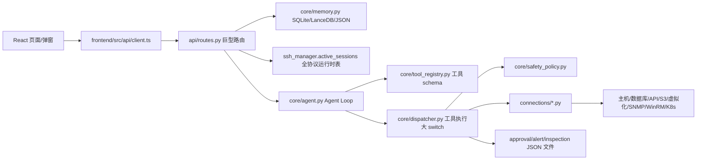
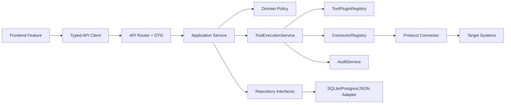

# OpsCore AIOps 100 分产品化重构总方案

## 0. 结论

OpsCore 当前已经具备 AIOps 产品的主要业务能力：资产中心、多协议连接、AI 会话、工具调用、安全策略、审批、自动巡检、告警、知识库、技能市场、模型配置、快捷命令、画像、Webhook 和总览看板。

当前问题不是“功能不够”，而是实现方式仍处于堆砌阶段：后端巨型路由和巨型 dispatcher 承担过多职责，连接运行时把 SSH 会话、数据库/API/对象存储/虚拟化等虚拟会话混放在 `ssh_manager.active_sessions`，安全策略、审批、审计和工具执行没有形成统一治理闭环；前端则由巨型组件、全局 store、无路由页面切换和分散弹窗支撑复杂业务，已经接近维护上限。

本方案只做产品化重构，不新增业务功能，目标是在保持现有行为 100% 一致的前提下，把项目重构为可交付、可测试、可审计、可扩展、可部署的企业级 AIOps 平台。

## 1. 分析范围与明确假设

### 1.1 已分析范围

| 范围 | 当前关键文件 |
| --- | --- |
| 后端入口 | `main.py` |
| API 层 | `api/routes.py` |
| Agent 与工具执行 | `core/agent.py`、`core/dispatcher.py`、`core/tool_registry.py`、`core/llm_execution.py` |
| 安全策略 | `core/safety_policy.py`、`core/safety_action_catalog.py` |
| 资产目录 | `core/asset_protocols.py`、`core/asset_capabilities.py`、`core/hertzbeat_asset_catalog.py` |
| 连接管理 | `connections/*.py`、`ssh_manager.active_sessions` |
| 数据与记忆 | `core/memory.py`、SQLite、JSON 文件、LanceDB |
| 巡检/告警/审批 | `core/session_inspector.py`、`core/cron_manager.py`、`core/alert_events.py`、`core/approval_queue.py` |
| 会话画像/Webhook | `core/session_profile.py`、`api/routes.py` 会话 webhook 相关接口 |
| 前端 | `frontend/src/App.tsx`、`frontend/src/store/index.ts`、`frontend/src/api/client.ts`、`frontend/src/components/**` |
| 测试 | `tests/*`、`scripts/preflight.py`、`scripts/worktree_audit.py` |

### 1.2 明确假设

- “资产”指 OpsCore 托管的运维目标，包括主机、数据库、缓存、网络、安全、虚拟化、存储、对象存储、监控、带外、CI/CD、大数据、AI 平台和业务系统。
- “协议”指访问资产的执行通道，如 SSH、WinRM、SQL、Redis、MongoDB、HTTP API、SNMP、Kubernetes API、S3、Redfish、VMware API。
- “会话”不是 SSH 会话的同义词，而是资产上下文、模型上下文、工具上下文、安全上下文和运行状态的组合。
- “工具”指模型可调用的后端能力，例如 `linux_execute_command`、`db_execute_query`、`storage_api_request`、`snmp_get`。
- “产品化”指企业私有化交付标准：分层架构、统一契约、权限审计、配置外部化、可观测、可测试、可扩展、可升级。
- `.research/hermes-agent/` 和 HertzBeat 相关源码仅作为参考，不纳入常规 OpsCore 重构改动。

## 2. 当前项目事实

### 2.1 技术栈

| 层级 | 当前技术 |
| --- | --- |
| 后端 Web | FastAPI、Pydantic v2、Uvicorn |
| 后端协议 | Paramiko、pywinrm、PyMySQL、psycopg2、oracledb、pyodbc、redis、pymongo、pysnmp、netmiko、pyvmomi、boto3、JayDeBeApi |
| LLM | OpenAI SDK、Anthropic SDK、OpenAI 兼容供应商 |
| 调度 | APScheduler |
| 存储 | SQLite、JSON 文件、LanceDB |
| 加密 | Fernet、cryptography |
| 前端 | React 19、Vite、TypeScript、Zustand、Tailwind CSS |
| 前端内容渲染 | marked、DOMPurify |
| 测试 | pytest、unittest，前端暂无独立 test/lint 脚本 |

### 2.2 当前热点文件

| 文件 | 行数级别 | 说明 |
| --- | ---: | --- |
| `frontend/src/components/chat/ChatWindow.tsx` | 3300+ | 会话、流式、附件、审批、交互、消息编辑、快捷命令混在一起 |
| `api/routes.py` | 3100+ | 几乎所有 API、DTO、文件解析、连接测试、配置、巡检、Webhook 都在一个路由文件 |
| `core/asset_capabilities.py` | 2700+ | 资产能力静态数据巨大，缺配置化和校验 |
| `core/safety_policy.py` | 1800+ | 动作策略、旧规则、网络边界、只读判断、硬拦截耦合 |
| `frontend/src/components/modals/ConnectionModal.tsx` | 1500+ | 资产类型、凭证、协议参数、连接动作、错误提示耦合 |
| `core/inspection_templates.py` | 1400+ | 巡检模板和业务逻辑庞大 |
| `core/asset_protocols.py` | 1300+ | 资产类别、协议、字段映射大量硬编码 |
| `core/agent.py` | 1200+ | Agent loop、流式输出、工具循环、上限控制混杂 |
| `core/memory.py` | 1200+ | SQLite、LanceDB、资产、会话历史、知识相关职责混合 |
| `core/dispatcher.py` | 1000+ | 工具执行大 switch，策略、上下文、连接器调用耦合 |

### 2.3 当前核心业务实现逻辑

| 业务功能 | 当前实现逻辑 |
| --- | --- |
| 资产中心 | 前端 `AssetVault` 调后端 `/assets*`；后端通过 `core/memory.py` 存取 SQLite；资产类型来自 `asset_protocols`、`asset_capabilities`、`hertzbeat_asset_catalog` 等静态定义 |
| 资产连接 | `/connect/test`、`/connect/inspect`、`/connect` 在 `api/routes.py` 中按协议分支；SSH 由 `ssh_manager` 真实连接；DB/API/S3/虚拟化/SNMP/WinRM 等通过各自 manager 测试或按需执行 |
| 会话运行时 | `ssh_manager.active_sessions` 实际成为全协议运行时会话表，里面混放 SSH client、资产上下文、凭据、extra_args、权限、技能、心跳、流式状态 |
| AI 会话 | 前端 `ChatWindow` 调 `/chat` SSE；后端 `core/agent.py` 驱动 LLM loop，工具 schema 来自 `tool_registry`，执行落到 `dispatcher` |
| 工具系统 | `tool_registry` 保存 metadata/schema；`dispatcher.route_and_execute()` 按工具名执行，调用连接器、安全策略、知识库、通知、技能进化等 |
| 安全策略 | `safety_policy.py` 负责动作识别、只读拦截、审批、硬拦截、网络边界；前端 `SafetyPolicyModal` 展示动作权限和高级策略 |
| 审批 | `approval_queue.py` JSON 存储审批；聊天页、审批中心、工具执行共享队列 |
| 巡检 | `session_inspector.py` 和 `inspection_templates.py` 生成巡检；`cron_manager.py` 调度自动巡检；前端 `CronManager` 管理计划 |
| 告警 | `/webhook/alert` 接收外部告警；`alert_events.py` 存储；前端 `AlertCenter` 展示和处理 |
| 知识库 | `/knowledge/upload` 解析文件后进入 RAG/LanceDB；前端 `KnowledgeBase` 上传和管理 |
| 技能市场 | 扫描 `.agents/skills` 等目录；技能创建、校验、版本、回滚、迁移集中在 `api/routes.py` 和 `dispatcher` |
| 模型配置 | `providers.json`、环境变量和前端 `LLMConfigModal` 混合管理 |
| 快捷命令 | `slash_commands.py` 管内置和自定义命令；会话页按资产/协议显示 |

### 2.4 当前数据流



## 3. 当前核心架构问题

### 3.1 后端路由层过重

`api/routes.py` 同时承担 Controller、DTO、Service、Repository、配置写入、文件解析、连接测试、技能生命周期、Webhook 发送、巡检任务、Dashboard 聚合等职责。结果是：

- 任何业务改动都可能影响同一个巨型文件。
- 单元测试只能绕路由测，难以独立测试业务。
- 错误处理分散，部分接口用 HTTP error，部分用 `status="error"`。
- 配置和状态写入 `.env`、JSON、SQLite 的逻辑散落在路由层。

### 3.2 连接运行时边界错误

当前 `ssh_manager.active_sessions` 被当成全协议会话注册表使用，但名称和职责都偏 SSH：

- SSH/Linux 有真实 Paramiko client。
- 数据库、HTTP/API、S3、虚拟化、SNMP、WinRM 等通常没有同类长连接，而是运行时上下文 + 凭据 + extra_args + 按需执行器。
- `dispatcher`、`api/routes.py` 和前端都隐式依赖这个结构，导致数据库/API/S3 等能力难以产品化建模。

### 3.3 工具执行仍是中心化大 switch

`tool_registry.py` 已经有工具 schema，但注释也表明执行仍在 `dispatcher.py`。问题：

- 新增工具必须改 dispatcher。
- 安全策略、上下文解析、连接器调用、结果格式化混在一起。
- 工具无法自带权限声明、测试夹具、健康检查、协议适配。

### 3.4 安全策略复杂度对用户不友好

动作策略、审批规则、禁止规则、只读拦截、硬拦截、网络边界、高级正则同时存在。对普通运维用户来说：

- 不知道应该配动作权限还是审批规则。
- 正则表达和语义规则很难理解。
- 只读命令误拦截会影响 AI 运维体验。
- 点击“允许执行”后，如果本次已硬拦截，前端需要明确提示重新执行。

### 3.5 审批、审计、日志没有形成闭环

目前有审批队列和基础日志，但生产级还缺：

- request_id / trace_id / run_id / tool_call_id 全链路关联。
- 用户身份、角色、操作人和审批原因。
- 审计事件库，覆盖资产、工具、审批、策略、配置、Webhook。
- 可查询、不可抵赖、可导出的审计记录。

### 3.6 配置和运行态文件散落

根目录中存在 `.env`、`.fernet.key`、`providers.json`、`models.json`、`safety_policy.json`、`approval_requests.json`、`inspection_runs.json`、`cron_jobs.sqlite`、`opscore.db`、日志文件等运行态文件。产品化交付应区分：

- 源码。
- 配置。
- 密钥。
- 数据。
- 日志。
- 运行时缓存。

### 3.7 前端状态和组件过重

前端核心问题：

- `ChatWindow.tsx` 3300+ 行，包含会话、流式、消息、附件、审批、交互、快捷命令、画像和 Webhook。
- `ConnectionModal.tsx` 1500+ 行，包含资产类型、凭证、协议字段、连接测试、保存、错误处理。
- Zustand 全局 store 同时保存 view、session、message、sidebar、modal、asset、stream controller、toast。
- 无真正路由，刷新、返回、深链、筛选条件 URL 化都不足。

### 3.8 测试和发布门禁不完整

后端已有不少测试，但还缺产品化门禁：

- 前端 lint/test。
- 类型检查强约束。
- API contract test。
- 数据迁移测试。
- 连接器 fixture 测试。
- 安全策略决策矩阵测试。
- 端到端核心流程测试。

## 4. 目标架构设计

### 4.1 后端分层架构

```text
backend/app
├─ api/                       # Interface 层：FastAPI router、DTO、response envelope
├─ application/               # 应用层：用例编排、事务、权限、审计
├─ domain/                    # 领域层：资产、会话、工具、安全策略、审批、巡检等核心模型
├─ infrastructure/            # 基础设施层：DB、文件、连接器、LLM、通知、RAG、外部 API
├─ plugins/                   # 工具/连接器/知识源/通知插件
└─ shared/                    # 错误、日志、配置、DI、类型、时间、加密等共享能力
```

依赖规则：

- `api` 只能依赖 `application` 和 `shared`。
- `application` 依赖 `domain` 的接口和 `shared`。
- `domain` 不依赖 FastAPI、数据库、文件系统、LLM SDK。
- `infrastructure` 实现 `domain` 或 `application` 定义的接口。
- `plugins` 通过 manifest 和 registry 接入，不反向修改核心。

### 4.2 后端目标数据流



### 4.3 前端目标架构

```text
frontend/src
├─ app/                       # AppShell、Router、providers
├─ shared/                    # UI 基础组件、API 基类、错误、格式化、hooks
├─ features/
│  ├─ dashboard/
│  ├─ chat/
│  ├─ assets/
│  ├─ safety/
│  ├─ approvals/
│  ├─ alerts/
│  ├─ inspections/
│  ├─ knowledge/
│  ├─ skills/
│  ├─ models/
│  └─ quick-commands/
└─ styles/
```

前端依赖规则：

- 页面只组合 feature，不直接写复杂业务。
- feature 内部有 `api.ts`、`types.ts`、`hooks.ts`、`components/`。
- Server state 由 query/cache 层管理；表单状态留在组件或 hook；全局 store 只保存跨页面 UI 状态。
- URL 保存 view、filter、selected asset、approval status 等可分享状态。

## 5. 推荐新目录结构

```text
opscore/
├─ backend/
│  └─ app/
│     ├─ main.py
│     ├─ api/
│     │  ├─ routers/
│     │  │  ├─ chat.py
│     │  │  ├─ sessions.py
│     │  │  ├─ assets.py
│     │  │  ├─ connections.py
│     │  │  ├─ tools.py
│     │  │  ├─ safety.py
│     │  │  ├─ approvals.py
│     │  │  ├─ inspections.py
│     │  │  ├─ alerts.py
│     │  │  ├─ knowledge.py
│     │  │  ├─ skills.py
│     │  │  ├─ models.py
│     │  │  └─ settings.py
│     │  ├─ dto/
│     │  └─ responses.py
│     ├─ application/
│     │  ├─ assets/
│     │  ├─ sessions/
│     │  ├─ chat/
│     │  ├─ tools/
│     │  ├─ safety/
│     │  ├─ approvals/
│     │  ├─ inspections/
│     │  ├─ alerts/
│     │  ├─ knowledge/
│     │  ├─ skills/
│     │  └─ settings/
│     ├─ domain/
│     │  ├─ assets/
│     │  ├─ sessions/
│     │  ├─ connectors/
│     │  ├─ tools/
│     │  ├─ safety/
│     │  ├─ approvals/
│     │  └─ audit/
│     ├─ infrastructure/
│     │  ├─ persistence/
│     │  ├─ connectors/
│     │  ├─ llm/
│     │  ├─ rag/
│     │  ├─ notification/
│     │  └─ config/
│     ├─ plugins/
│     └─ shared/
├─ frontend/
│  └─ src/
│     ├─ app/
│     ├─ shared/
│     ├─ features/
│     └─ styles/
├─ docs/
├─ tests/
└─ scripts/
```

## 6. 目录结构对照表

| 当前位置 | 重构后位置 | 说明 |
| --- | --- | --- |
| `main.py` | `backend/app/main.py` | 只保留应用创建、中间件、路由注册、生命周期 |
| `api/routes.py` | `backend/app/api/routers/*.py` + `application/*` | 按业务域拆 router，业务移到 service |
| `core/memory.py` | `infrastructure/persistence/*` + domain repository 接口 | 分拆资产、会话历史、知识、配置、运行记录 |
| `connections/ssh_manager.py` | `infrastructure/connectors/ssh.py` + `application/sessions/session_registry.py` | SSH 执行器和全协议会话表解耦 |
| `connections/db_manager.py` | `infrastructure/connectors/database/*` | 数据库 connector，内部按 driver adapter |
| `connections/http_api_manager.py` | `infrastructure/connectors/http_api.py` | HTTP/API connector，加入网络边界和 SSRF 防护 |
| `connections/object_storage_manager.py` | `infrastructure/connectors/object_storage.py` | S3/MinIO/Ceph RGW connector |
| `connections/virtualization_manager.py` | `infrastructure/connectors/virtualization.py` | VMware/OpenStack/Proxmox 等 |
| `connections/snmp_manager.py` | `infrastructure/connectors/snmp.py` | SNMP 只读/写操作分级 |
| `core/dispatcher.py` | `application/tools/tool_execution_service.py` + `plugins/tools/*` | 工具执行插件化 |
| `core/tool_registry.py` | `domain/tools/spec.py` + `plugins/tool_registry.py` | schema、权限、执行器统一注册 |
| `core/safety_policy.py` | `domain/safety/*` + `application/safety/*` | 动作识别、策略决策、网络边界拆分 |
| `core/approval_queue.py` | `application/approvals/*` + `infrastructure/persistence/approval_repository.py` | 审批服务和持久化分离 |
| `core/cron_manager.py` | `application/inspections/scheduler.py` | 自动巡检任务服务 |
| `frontend/src/api/client.ts` | `frontend/src/shared/api/http.ts` + `features/*/api.ts` | API client 按 feature 拆分 |
| `frontend/src/store/index.ts` | `features/*/store.ts` + `shared/state/uiStore.ts` | 全局 store 拆分 |
| `ChatWindow.tsx` | `features/chat/*` | 会话工作台组件化 |
| `ConnectionModal.tsx` | `features/assets/components/AssetConnectionModal/*` | 资产类型、凭证、协议参数、测试结果拆分 |

## 7. 核心重构准则

### 7.1 单一职责

- Router 只做 HTTP 协议适配。
- Service 只做用例编排。
- Domain 只表达业务规则。
- Repository 只负责数据访问。
- Connector 只负责协议连接与执行。
- ToolPlugin 只负责工具声明和工具执行入口。
- React 组件只负责展示和局部交互。

### 7.2 依赖注入

用 `Container` 统一装配 service、repository、connector、LLM provider、policy engine。禁止业务代码直接 import 全局单例。

### 7.3 统一错误处理

后端统一错误结构：

```json
{
  "status": "error",
  "error": {
    "code": "credential_invalid",
    "category": "credential",
    "message": "用户名或密码错误",
    "request_id": "req_xxx",
    "details": {}
  }
}
```

前端统一映射：

- `credential_invalid`：用户名或密码错误。
- `connection_failed`：连接失败，请检查地址、端口、防火墙或网络。
- `driver_missing`：驱动缺失，显示下载与配置路径。
- `permission_denied`：权限不足。
- `policy_blocked`：安全策略已拦截。
- `internal_error`：系统内部错误，显示 request_id。

### 7.4 全链路日志

每条链路必须包含：

- `request_id`
- `user_id`
- `session_id`
- `run_id`
- `tool_call_id`
- `asset_id`
- `policy_decision_id`
- `approval_id`

### 7.5 配置外部化

- 环境变量只作为部署覆盖。
- 用户可编辑配置进入 `ConfigRepository`。
- 密钥进入 `CredentialProvider`。
- 禁止路由层直接写 `.env`。
- 运行态数据迁移到 `data/` 或数据库，不混在源码根目录。

### 7.6 类型安全与代码风格

- Python 使用 Pydantic DTO + dataclass/domain model + mypy 分阶段收紧。
- TypeScript 保持 `strict: true`，增加 ESLint、前端单测。
- API DTO 与 Domain Model 分离。
- 禁止裸 `except:` 和无结构错误字符串。

### 7.7 测试与健壮性

- Phase 0 先建 characterization tests，冻结现有行为。
- 后端按 domain/service/connector/policy 分层测试。
- 前端按 API client、hooks、关键组件、E2E 测试。
- 每种协议 connector 有至少一个成功、认证失败、网络失败、权限失败 fixture。

### 7.8 扩展性与插件化

未来新增资产/协议/工具时，只新增插件，不改巨型 dispatcher：

- Connector plugin：协议连接。
- Tool plugin：模型工具。
- Knowledge source plugin：知识源。
- Notification plugin：通知通道。
- Model provider plugin：模型供应商。
- Asset catalog plugin：资产类型和字段定义。

## 8. 核心模块接口定义与代码骨架

### 8.1 Settings 与依赖注入

```python
from dataclasses import dataclass
from pathlib import Path

@dataclass(frozen=True)
class AppSettings:
    host: str
    port: int
    data_dir: Path
    log_level: str
    api_token: str | None
    allowed_origins: list[str]

class SettingsProvider:
    def load(self) -> AppSettings:
        ...

class Container:
    def __init__(self, settings: AppSettings):
        self.settings = settings
        self.asset_repo = SqliteAssetRepository(settings.data_dir)
        self.session_registry = InMemorySessionRegistry()
        self.credential_provider = EncryptedCredentialProvider(settings.data_dir)
        self.connector_registry = ConnectorRegistry()
        self.tool_registry = ToolPluginRegistry()
        self.audit_service = AuditService(...)
```

### 8.2 统一错误

```python
class OpsError(Exception):
    code = "internal_error"
    category = "internal"
    http_status = 500

    def __init__(self, message: str, details: dict | None = None):
        self.message = message
        self.details = details or {}

class CredentialInvalidError(OpsError):
    code = "credential_invalid"
    category = "credential"
    http_status = 401

class ConnectionFailedError(OpsError):
    code = "connection_failed"
    category = "connection"
    http_status = 502

class PolicyBlockedError(OpsError):
    code = "policy_blocked"
    category = "security"
    http_status = 403
```

### 8.3 Repository

```python
from typing import Protocol

class AssetRepository(Protocol):
    def list(self, query: AssetQuery) -> list[Asset]: ...
    def get(self, asset_id: int) -> Asset: ...
    def create(self, asset: AssetCreate) -> Asset: ...
    def update(self, asset_id: int, patch: AssetPatch) -> Asset: ...
    def delete(self, asset_id: int) -> None: ...

class ConfigRepository(Protocol):
    def get(self, key: str) -> dict: ...
    def set(self, key: str, value: dict, actor: Actor) -> None: ...

class AuditRepository(Protocol):
    def append(self, event: AuditEvent) -> None: ...
    def query(self, query: AuditQuery) -> list[AuditEvent]: ...
```

### 8.4 SessionRegistry

```python
from dataclasses import dataclass
from typing import Any

@dataclass(frozen=True)
class CredentialRef:
    provider: str
    key: str

@dataclass
class RuntimeSession:
    id: str
    asset_id: int | None
    protocol: str
    target: dict[str, Any]
    credential_ref: CredentialRef | None
    extra_args: dict[str, Any]
    permissions: SessionPermissions
    active_skills: list[str]
    status: str

class SessionRegistry(Protocol):
    def create(self, session: RuntimeSession) -> RuntimeSession: ...
    def get(self, session_id: str) -> RuntimeSession: ...
    def update(self, session_id: str, patch: dict) -> RuntimeSession: ...
    def list(self) -> list[RuntimeSession]: ...
    def close(self, session_id: str) -> None: ...
```

### 8.5 ConnectorRegistry 与协议连接器

```python
class Connector(Protocol):
    protocol: str

    async def test(self, target: ConnectionTarget, credential: Credential) -> ConnectionTestResult:
        ...

    async def open(self, target: ConnectionTarget, credential: Credential) -> ConnectorSession:
        ...

    async def execute(
        self,
        session: RuntimeSession,
        operation: ConnectorOperation,
        credential: Credential,
    ) -> ConnectorResult:
        ...

class ConnectorRegistry:
    def __init__(self) -> None:
        self._connectors: dict[str, Connector] = {}

    def register(self, connector: Connector) -> None:
        self._connectors[connector.protocol] = connector

    def get(self, protocol: str) -> Connector:
        try:
            return self._connectors[protocol]
        except KeyError as exc:
            raise OpsError(f"不支持的协议：{protocol}") from exc
```

连接器必须覆盖：

| 连接器 | 协议范围 |
| --- | --- |
| `SshConnector` | Linux/Unix、网络 CLI、部分存储 CLI |
| `WinrmConnector` | Windows PowerShell/命令 |
| `DatabaseConnector` | Oracle、MySQL、PostgreSQL、SQL Server、达梦等 |
| `DatastoreConnector` | Redis、MongoDB、Memcached |
| `HttpApiConnector` | 通用 HTTP/API、监控 API、业务系统 API |
| `ObjectStorageConnector` | S3、MinIO、Ceph RGW、云对象存储 |
| `StoragePlatformConnector` | NAS/SAN/存储阵列 API |
| `VirtualizationConnector` | VMware、OpenStack、Proxmox、私有云 |
| `SnmpConnector` | SNMP v2/v3 |
| `KubernetesConnector` | K8s get/list/log/exec/apply/delete |

### 8.6 ToolPlugin

```python
@dataclass(frozen=True)
class ToolSpec:
    name: str
    toolset: str
    description: str
    input_schema: dict
    protocols: set[str]
    asset_types: set[str]
    safety_category: str

@dataclass
class ToolCall:
    id: str
    name: str
    args: dict

@dataclass
class ToolResult:
    status: str
    data: dict | list | str | None = None
    message: str = ""
    metadata: dict | None = None

class ToolPlugin(Protocol):
    spec: ToolSpec

    async def execute(self, call: ToolCall, context: ExecutionContext) -> ToolResult:
        ...
```

### 8.7 ToolExecutionService

```python
class ToolExecutionService:
    def __init__(
        self,
        tools: ToolPluginRegistry,
        sessions: SessionRegistry,
        credentials: CredentialProvider,
        policy: SafetyPolicyEngine,
        approvals: ApprovalService,
        audit: AuditService,
    ):
        ...

    async def execute(self, call: ToolCall, context: ExecutionContext) -> ToolResult:
        tool = self.tools.get(call.name)
        decision = self.policy.evaluate(call, context)
        await self.audit.record_policy_decision(call, context, decision)

        if decision.action == "block":
            raise PolicyBlockedError(decision.reason)
        if decision.action == "approval":
            return await self.approvals.request(call, context, decision)

        result = await tool.execute(call, context)
        await self.audit.record_tool_result(call, context, result)
        return result
```

### 8.8 安全策略

```python
@dataclass(frozen=True)
class ActionRule:
    subject: str
    action: str
    readonly_mode: str   # allow | approval | block
    readwrite_mode: str  # allow | approval | block
    description: str

class ActionDetector(Protocol):
    def detect(self, call: ToolCall, context: ExecutionContext) -> DetectedAction: ...

class NetworkBoundary(Protocol):
    def evaluate(self, target: NetworkTarget, context: ExecutionContext) -> PolicyDecision: ...

class SafetyPolicyEngine:
    def evaluate(self, call: ToolCall, context: ExecutionContext) -> PolicyDecision:
        action = self.action_detector.detect(call, context)
        network_decision = self.network_boundary.evaluate_from_call(call, context)
        if network_decision.is_blocking:
            return network_decision
        return self.action_rules.decide(action, context.permissions)
```

### 8.9 审批与审计

```python
@dataclass(frozen=True)
class AuditEvent:
    id: str
    type: str
    actor_id: str
    request_id: str
    session_id: str | None
    asset_id: int | None
    tool_call_id: str | None
    payload: dict
    created_at: datetime

class ApprovalService:
    async def request(
        self,
        call: ToolCall,
        context: ExecutionContext,
        decision: PolicyDecision,
    ) -> ToolResult:
        ...

    async def decide(self, approval_id: str, decision: ApprovalDecision, actor: Actor) -> None:
        ...
```

### 8.10 前端 API 和会话 Hook

```ts
export type ApiErrorCategory =
  | 'credential'
  | 'connection'
  | 'driver'
  | 'permission'
  | 'security'
  | 'internal'

export class OpsApiError extends Error {
  code: string
  category: ApiErrorCategory
  requestId?: string
  details?: unknown
}

export async function apiRequest<T>(input: ApiRequest): Promise<T> {
  const response = await fetch(input.url, input.options)
  const payload = await response.json().catch(() => null)
  if (!response.ok || payload?.status === 'error') {
    throw normalizeApiError(payload, response.status)
  }
  return payload.data as T
}
```

```tsx
export function useChatStream(sessionId: string) {
  const appendMessage = useChatStore((s) => s.appendMessage)
  const updateRunState = useChatRunStore((s) => s.update)

  const send = async (input: ChatSendInput) => {
    updateRunState(sessionId, { status: 'running' })
    await streamChat(input, {
      onMessage: (chunk) => appendMessage(sessionId, chunk),
      onInteraction: (item) => dockStore.add(item),
      onDone: () => updateRunState(sessionId, { status: 'idle' }),
    })
  }

  return { send }
}
```

## 9. 通用组件和服务

### 9.1 后端通用服务

| 服务 | 职责 |
| --- | --- |
| `RequestContextMiddleware` | 生成 request_id，解析 actor，注入 context |
| `ErrorHandler` | 捕获 OpsError/ValidationError/未知异常，输出统一 envelope |
| `AuditService` | 记录工具、审批、资产、配置、策略、Webhook 事件 |
| `ConfigService` | 统一配置读写、脱敏、审计 |
| `CredentialProvider` | 密钥加密存储、按引用读取、脱敏输出 |
| `RunRepository` | 会话任务持久化，支持刷新后恢复 |
| `PluginLoader` | 加载工具、连接器、通知、知识源插件 |

### 9.2 前端通用组件

| 组件 | 使用位置 |
| --- | --- |
| `AppShell` | 全局布局 |
| `PageHeader` | 所有页面标题、说明、主操作 |
| `DataToolbar` | 表格筛选、搜索、批量操作 |
| `DataTable` | 资产、审批、告警、巡检、知识文档列表 |
| `DetailDrawer` | 资产详情、审批详情、告警详情 |
| `ErrorBanner` | API 错误分类展示 |
| `StatusBadge` | 资产、任务、审批、告警状态 |
| `ConfirmDialog` | 危险操作二次确认 |
| `InteractionDock` | 会话审批、选择题、交互输入、拦截动作配置 |
| `AttachmentTray` | 图片、Excel、txt、Word、PDF 附件解析预览 |

## 10. 扩展点设计

| 扩展点 | 扩展方式 | 示例 |
| --- | --- | --- |
| 新资产类型 | Asset catalog plugin | 新增 OceanBase、Kafka、堡垒机 |
| 新协议连接 | Connector plugin | Redfish、JMX、LDAP、Elasticsearch |
| 新模型工具 | Tool plugin | `oracle_backup_check`、`vm_snapshot_list` |
| 新通知通道 | Notification plugin | 飞书、钉钉、企业微信、邮件、自定义 HTTP |
| 新知识源 | Knowledge source plugin | Obsidian、Git 仓库、Confluence、文件目录 |
| 新模型供应商 | Model provider plugin | 本地模型、私有 OpenAI compatible gateway |
| 新安全动作 | Action detector plugin | Kubernetes apply、S3 bucket policy、Oracle archive log |

## 11. 测试示例

### 11.1 安全策略动作决策测试

```python
def test_linux_readonly_command_is_allowed_in_readonly_mode(policy_engine):
    call = ToolCall(
        id="tool_1",
        name="linux_execute_command",
        args={"command": "systemctl status nginx"},
    )
    context = ExecutionContext(
        protocol="ssh",
        permissions=SessionPermissions(readwrite=False),
        asset_type="linux",
    )

    decision = policy_engine.evaluate(call, context)

    assert decision.action == "allow"
    assert decision.detected_action == "read_service_status"
```

```python
def test_oracle_system_change_requires_approval(policy_engine):
    call = ToolCall(
        id="tool_1",
        name="db_execute_query",
        args={"query": "ALTER SYSTEM SWITCH LOGFILE"},
    )
    context = ExecutionContext(
        protocol="oracle",
        permissions=SessionPermissions(readwrite=True),
        asset_type="oracle",
    )

    decision = policy_engine.evaluate(call, context)

    assert decision.action == "approval"
    assert decision.detected_action == "database_system_change"
```

### 11.2 连接错误分类测试

```python
def test_ssh_auth_error_maps_to_credential_invalid():
    raw = Exception("Authentication failed.")

    error = map_connection_error(raw, protocol="ssh")

    assert error.code == "credential_invalid"
    assert error.category == "credential"
    assert "密码" in error.message or "认证" in error.message
```

```python
def test_oracle_thin_driver_verifier_error_maps_to_driver_or_mode_hint():
    raw = Exception("DPY-3015: password verifier type is not supported in thin mode")

    error = map_connection_error(raw, protocol="oracle")

    assert error.code in {"driver_required", "driver_mode_unsupported"}
    assert error.category == "driver"
    assert "Oracle Instant Client" in error.message
```

### 11.3 前端 API 错误测试

```ts
it('maps business status error to OpsApiError', async () => {
  mockFetch({
    ok: true,
    status: 200,
    json: async () => ({
      status: 'error',
      error: { code: 'credential_invalid', category: 'credential', message: '用户名或密码错误' },
    }),
  })

  await expect(apiRequest({ url: '/api/v1/connect/test' }))
    .rejects.toMatchObject({
      code: 'credential_invalid',
      category: 'credential',
    })
})
```

## 12. 分阶段实施路线图

### Phase 1：行为冻结与架构基座

处理模块：

- `main.py`
- `api/routes.py`
- `frontend/src/api/client.ts`
- `core/dispatcher.py`
- `connections/*.py`

具体操作：

1. 建立 characterization tests，固定当前 API 响应、工具结果、安全策略决策、资产连接参数转换。
2. 新建 Settings、Error、RequestContext、Container，但先包装现有单例。
3. 给 `ssh_manager.active_sessions` 加 `LegacyRuntimeSessionStore` 兼容包装。
4. 建立统一 response envelope 和错误分类，不改变旧接口字段。
5. 增加 request_id 日志上下文。

验收标准：

- 现有资产添加、连接测试、打开会话、AI 对话、审批、巡检、告警、知识库、技能市场流程不变。
- 新旧错误响应兼容，前端仍能正常显示。
- 有测试证明 `status="error"` 和 HTTP error 都被前端统一处理。

### Phase 2：拆分 API、Service、Repository

处理模块：

- `api/routes.py`
- `core/memory.py`
- JSON 存储文件

具体操作：

1. 按业务域拆 router：chat、sessions、assets、connections、tools、safety、approvals、inspections、alerts、knowledge、skills、models、settings。
2. 提取 Application Service：`AssetService`、`SessionService`、`ConnectionService`、`ApprovalService`、`InspectionService`。
3. 提取 Repository 接口，SQLite/JSON 作为 infrastructure 实现。
4. 禁止新 router 直接访问文件系统、数据库、连接器。

验收标准：

- API 路径和响应保持兼容。
- `api/routes.py` 只保留兼容转发或逐步清空。
- 每个 service 至少有单元测试。

### Phase 3：连接器和工具插件化

处理模块：

- `connections/*.py`
- `core/dispatcher.py`
- `core/tool_registry.py`

具体操作：

1. 建立 `SessionRegistry`，从 SSH manager 剥离全协议会话上下文。
2. 建立 `ConnectorRegistry`，注册 SSH、WinRM、Database、Datastore、HTTP API、Object Storage、Storage Platform、Virtualization、SNMP、Kubernetes。
3. 把 dispatcher 中的每类工具迁移为 `ToolPlugin`。
4. 工具插件声明协议、资产类型、安全类别、schema、执行器和测试夹具。

验收标准：

- 新增工具不再需要修改 dispatcher 主 switch。
- 数据库非查询 SQL 在读写模式下按动作策略执行/审批，不再被 SELECT-only 误限制。
- Oracle、MySQL、SSH、WinRM、S3、SNMP、虚拟化至少各有 connector 测试。

### Phase 4：安全、审批、审计和运行任务治理

处理模块：

- `core/safety_policy.py`
- `core/approval_queue.py`
- `core/agent.py`
- `core/chat_runs.py`

具体操作：

1. 拆分 action detector、network boundary、action rule engine、legacy rule adapter。
2. 动作权限成为主配置，审批规则/禁止规则只作为高级兼容。
3. 建立 `AuditEventRepository`。
4. 建立 `RunRepository`，会话任务支持刷新后恢复、停止、阶段性报告。
5. 前端交互确认统一进入 `InteractionDock`。

验收标准：

- Linux 常见只读命令默认允许。
- 网络边界覆盖 HTTP GET、域名、Ping、CIDR、未知目标。
- 点击拦截卡片生成动作规则，不需要用户写正则。
- 每次工具执行可追踪到策略决策和审计事件。

### Phase 5：前端产品化拆分与线稿落地

处理模块：

- `App.tsx`
- `store/index.ts`
- `ChatWindow.tsx`
- `ConnectionModal.tsx`
- `AssetVault.tsx`
- `SafetyPolicyModal.tsx`

具体操作：

1. 引入真正路由，URL 保存页面、筛选、选中资产、审批状态。
2. 按 feature 拆 API、hooks、types、components。
3. Chat 拆成 `SessionList`、`SessionRunBar`、`MessageList`、`MessageBubble`、`InteractionDock`、`Composer`、`AttachmentTray`、`AssetProfilePanel`。
4. ConnectionModal 拆成资产类型选择、连接凭证、协议参数、测试结果、底部操作。
5. 统一页面 Header、表格、筛选、详情抽屉、错误提示和空状态。

验收标准：

- `npm run build` 通过。
- ChatWindow 主文件降到 300 行以内。
- 输入框自动增高，附件可先解析再发送。
- 审批/交互不再藏在流输出底部。
- 资产保存成功后列表和详情刷新。

### Phase 6：质量门禁与交付形态

处理模块：

- `scripts/*`
- `tests/*`
- 前端 test/lint
- 部署配置

具体操作：

1. 增加后端 lint、type check、unit、contract、security scan。
2. 增加前端 lint、type check、unit、build、E2E。
3. 增加 DB migration 和数据备份/回滚流程。
4. 标准化配置目录、数据目录、日志目录、密钥目录。
5. 输出部署文档、升级文档、运维手册和验收 checklist。

验收标准：

- 一条命令完成 preflight。
- 敏感文件、运行态文件、外部源码不会误提交。
- 新环境可按文档部署并通过健康检查。
- 关键用户路径 E2E 通过。

## 13. 100 分生产级完成定义

必须同时满足：

- 后端每个业务域有独立 router、service、repository。
- `SessionRegistry` 与 SSH manager 解耦，所有协议 connector 有明确边界。
- 工具执行插件化，不再依赖 dispatcher 大 switch。
- API 错误、前端错误提示和日志 request_id 统一。
- 全链路日志和审计覆盖工具、审批、策略、资产、配置、Webhook。
- 配置、密钥、数据、日志不混在源码根目录。
- 安全策略以动作权限为主，普通用户可理解可配置。
- 前端每个页面有清晰 feature 边界。
- 巨型组件拆分完成。
- 核心业务有单元测试、契约测试和 E2E 测试。
- 发布门禁包含测试、类型检查、lint、依赖检查、安全扫描、前端 build。
- Hermes、HertzBeat 等外部源码仅作 reference，不参与常规重构提交。

## 14. 前端线稿图

### 14.1 全局框架

```text
+------------------------------------------------------------------------------------------------+
| 顶部栏：面包屑 / 当前页面标题                         全局搜索  任务中心  通知  用户          |
+----------------------+-------------------------------------------------------------------------+
| 左侧导航             | 页面主体                                                                  |
|                      |                                                                         |
| OPS                  | +---------------------------------------------------------------------+ |
|                      | | 页面 Header：标题、说明、主操作、页面级筛选                         | |
| 工作台               | +---------------------------------------------------------------------+ |
| [图标] 总览大屏      | |                                                                     | |
| [图标] AI 会话       | | 内容区：表格 / 会话 / 卡片 / 配置面板                                | |
| [图标] 资产中心      | |                                                                     | |
| [图标] 自动巡检      | |                                                                     | |
| [图标] 告警事件      | +---------------------------------------------------------------------+ |
| [图标] 审批中心      |                                                                         |
|                      |                                                                         |
| 能力库               |                                                                         |
| [图标] 技能市场      |                                                                         |
| [图标] 知识库        |                                                                         |
|                      |                                                                         |
| 系统                 |                                                                         |
| [图标] 模型配置      |                                                                         |
| [图标] 安全策略      |                                                                         |
| [图标] 告警通道      |                                                                         |
| [图标] 快捷命令      |                                                                         |
+----------------------+-------------------------------------------------------------------------+
```

规则：

- 左侧导航展开态固定显示图标 + 中文名称，不再用“总、会、资”。
- 顶部栏只显示页面级信息。
- 只读、巡检、技能、模型、思考模式只在 AI 会话页出现。

### 14.2 总览大屏

```text
+------------------------------------------------------------------------------------------------+
| 总览大屏                                            时间范围 [近24小时 v]  刷新  全屏          |
+------------------------------------------------------------------------------------------------+
| 指标卡：资产总数 | 在线会话 | 未处理告警 | 待审批 | 今日巡检 | 高危风险                    |
+------------------------------------------------------------------------------------------------+
| 左：资产健康分布                              | 右：数据中心趋势                              |
| +------------------------------------------+ | +------------------------------------------+ |
| | 主机  数据库  网络  存储  虚拟化          | | CPU/内存/告警/巡检趋势折线                 | |
| | 健康 / 风险 / 离线                        | | 可切换：基础设施 / 数据库 / 网络            | |
| +------------------------------------------+ | +------------------------------------------+ |
+------------------------------------------------------------------------------------------------+
| 左：重点风险资产                              | 中：最近自动巡检                              | 右：待处理审批 |
| +------------------------------------------+ | +------------------------------------------+ | +------------+ |
| | 资产  风险  等级  负责人  操作            | | 任务  状态  耗时  结论                      | | 审批项列表   | |
| +------------------------------------------+ | +------------------------------------------+ | +------------+ |
+------------------------------------------------------------------------------------------------+
```

### 14.3 AI 会话工作台

```text
+------------------------------------------------------------------------------------------------+
| AI 会话                                                                 新建会话  会话设置      |
+------------------------------------------------------------------------------------------------+
| 会话列表 280px        | 当前会话 1fr                                           | 资产上下文 320px |
| +------------------+ | +---------------------------------------------------+ | +--------------+ |
| | 搜索会话          | | 会话运行条：资产名 / 协议 / 状态 / 执行中圈圈       | | 资产画像       | |
| | [运行中] 172...   | | 权限 [只读]  巡检 [关]  技能 [2]  更多             | | 用途识别       | |
| | [空闲] Oracle     | +---------------------------------------------------+ | 风险摘要       | |
| | [异常] WinServer  | | 置顶通知 Dock：审批、交互输入、选择题、阻断原因     | | 关键指标       | |
| |                  | +---------------------------------------------------+ | 连接信息       | |
| | 分组：生产/测试   | | 消息列表                                            | | 快捷动作       | |
| +------------------+ | |                                                   | +--------------+ |
|                      | | 用户消息靠右，助手消息占满可读宽度                 |                  |
|                      | | 工具轨迹可折叠，不挤占主答案                       |                  |
|                      | +---------------------------------------------------+                  |
|                      | | 快捷命令条：/inspect /config /status /risk ...      |                  |
|                      | +---------------------------------------------------+                  |
|                      | | 附件预览区：图片 / Excel / txt / Word / PDF         |                  |
|                      | +---------------------------------------------------+                  |
|                      | | 输入框：自动增高 3 到 10 行                         |                  |
|                      | | [上传] [快捷命令] [模型 v] [思考 v]      [发送]     |                  |
|                      | +---------------------------------------------------+                  |
+------------------------------------------------------------------------------------------------+
```

会话交互规则：

- 助手消息使用主内容区全宽，不再只显示左半边。
- 中文答案字号 15 到 16px，行高 1.65。
- 输入框内容增多自动扩张，超过上限后内部滚动。
- 发送按钮靠近输入框内部右侧，但避开屏幕右下角输入法误触区。
- 会话执行中时，会话列表和运行条都有圈圈状态。
- 审批、交互式密码、选择题、拦截动作配置固定在 Dock，不滚到消息底部。

### 14.4 会话消息

```text
用户消息：
                                              +---------------------------------------------+
                                              | 请查看当前 linux/ssh 172.17.10.2 的配置...   |
                                              +---------------------------------------------+

助手消息：
+--------------------------------------------------------------------------------------------+
| 正在通过原生协议对资产 172.17.10.2 进行深度配置抓取。                                      |
|                                                                                            |
| 1. 基础信息                                                                                 |
|    主机名：ubuntu                                                                           |
|    操作系统：Ubuntu 22.04.4 LTS                                                             |
|                                                                                            |
| [查看工具轨迹 2] [生成资产画像] [发送到 Webhook] [复制] [编辑] [删除]                       |
+--------------------------------------------------------------------------------------------+
```

### 14.5 交互与确认 Dock

```text
+--------------------------------------------------------------------------------------------+
| 需要确认                                                                                   |
| 工具 linux_execute_command 请求读取事件日志                                                 |
| 原因：安全策略要求确认                                                                      |
|                                                                                            |
| 以后遇到这类动作： [允许执行] [需要审批] [禁止执行]                                         |
| 本次操作：          [允许本次] [拒绝] [填写原因]                                           |
+--------------------------------------------------------------------------------------------+
```

### 14.6 附件发送

```text
+--------------------------------------------------------------------------------------------+
| 附件预览                                                                                   |
| +------------------+ +------------------+ +------------------+                             |
| | report.xlsx      | | topology.png     | | runbook.docx     |                             |
| | 已解析 4 张表     | | 已识别 1 张图     | | 已提取 8 段文本   |                             |
| | [查看] [移除]     | | [查看] [移除]     | | [查看] [移除]     |                             |
| +------------------+ +------------------+ +------------------+                             |
+--------------------------------------------------------------------------------------------+
| 输入补充说明...                                                                            |
| [上传文件] [粘贴图片] [快捷命令] [模型] [思考]                                  [发送]      |
+--------------------------------------------------------------------------------------------+
```

### 14.7 资产中心

```text
+------------------------------------------------------------------------------------------------+
| 资产中心                                                  新增资产  批量导入  导出             |
+------------------------------------------------------------------------------------------------+
| 目录树 240px          | 资产列表 1fr                                           | 详情 360px     |
| +------------------+ | +---------------------------------------------------+ | +--------------+ |
| | 全部资产          | | 筛选：分类 [全部] 协议 [全部] 状态 [全部] 搜索      | | 资产概览       | |
| | 操作系统与主机    | +---------------------------------------------------+ | 名称/地址/端口 |
| | 数据库            | | 表格：名称  类型  协议  地址  凭证  状态  操作     | | 协议能力       | |
| | 网络与安全        | | MySQL-Prod  MySQL TCP  10.0... 托管  正常  会话    | | 连接凭证       | |
| | 虚拟化与云        | | Oracle19c   Oracle TCP 172...  托管  异常  测试    | | 相关会话       | |
| | 存储              | | MinIO       S3    HTTPS ...     托管  正常  配置    | | 最近巡检       | |
| +------------------+ +---------------------------------------------------+ | 风险画像       | |
|                                                                          +--------------+ |
+------------------------------------------------------------------------------------------------+
```

联动规则：

- 资产目录、资产类别、协议、连接凭证必须联动。
- 资产类别决定推荐协议和默认字段。
- 协议决定连接凭证表单。
- 数据库资产默认应显示数据库协议，不应被 HTTP/REST 误导。

### 14.8 新增/编辑资产弹窗

```text
+--------------------------------------------------------------------------------------------+
| 新增资产                                                                   关闭             |
+--------------------------------------------------------------------------------------------+
| 步骤：1 资产类型 > 2 地址与凭证 > 3 协议参数 > 4 测试与保存                                  |
+--------------------------------------------------------------------------------------------+
| 左：资产类型                         | 右：表单                                             |
| +----------------------------------+ | +--------------------------------------------------+ |
| | 搜索资产类型                      | | 资产名称                                           | |
| | 操作系统与主机                    | | [cn-iso27001-server-t]                             | |
| | 数据库                            | | 分组 [未分组 v]                                    | |
| | 虚拟化与云                        | | 主机地址 [172.17.8.131]  端口 [22]                 | |
| | 存储                              | | 用户名 [chroot]      凭证 [托管凭证 v]             | |
| | 中间件                            | | 密码 [********]                                   | |
| +----------------------------------+ | | 会话权限 [只读巡检] [允许变更]                    | |
|                                      | +--------------------------------------------------+ |
+--------------------------------------------------------------------------------------------+
| 连接测试结果：密码错误 / 网络不可达 / 驱动缺失 / 权限不足 / 内部错误 / 成功                   |
+--------------------------------------------------------------------------------------------+
|                                                    测试连接  只读巡检  连接并打开会话  保存    |
+--------------------------------------------------------------------------------------------+
```

弹窗规则：

- 鼠标移出不关闭，只能点击关闭、取消或 Esc。
- 保存成功后资产列表和目录统计立即刷新。
- 测试结果必须在弹窗内显示具体分类。

### 14.9 安全策略

```text
+------------------------------------------------------------------------------------------------+
| 安全策略                                                   保存  测试策略  查看审计             |
+------------------------------------------------------------------------------------------------+
| 标签：动作权限 | 网络边界 | 运行限制 | 高级设置                                                 |
+------------------------------------------------------------------------------------------------+
| 动作权限                                                                                       |
| +----------------+---------------+----------------+----------------+-------------------------+ |
| | 适用对象       | 动作类别       | 默认策略       | 读写模式策略   | 说明                    | |
| | Linux/Unix     | 读取系统信息   | 允许           | 允许           | free/df/lscpu/systemctl | |
| | Linux/Unix     | 修改系统配置   | 需要审批       | 需要审批       | systemctl restart 等    | |
| | 数据库         | 查询数据       | 允许           | 允许           | SELECT/show 等          | |
| | 数据库         | 结构/系统变更  | 需要审批       | 需要审批       | ALTER/SWITCH LOGFILE    | |
| | 对象存储       | 删除对象       | 禁止           | 需要审批       | delete object/bucket    | |
| +----------------+---------------+----------------+----------------+-------------------------+ |
|                                                                                               |
| 从拦截记录生成规则：最近被拦截动作 [读取事件日志] [读取挂载表] [数据库日志切换]                |
+------------------------------------------------------------------------------------------------+
```

网络边界：

```text
+------------------------------------------------------------------------------------------------+
| 网络边界                                                                                       |
| 允许活动范围： [10.0.0.0/8] [172.16.0.0/12] [192.168.0.0/16] [+ 添加]                         |
| 未知目标：    [禁止主动探测] [只允许只读请求] [需要审批]                                       |
| 适用协议：    [SSH] [WinRM] [HTTP/API] [SNMP] [数据库] [S3] [虚拟化]                           |
| 测试命令/URL： [ping example.com] [测试] -> 结果：会被拦截，原因：不在允许范围                 |
+------------------------------------------------------------------------------------------------+
```

### 14.10 审批中心

```text
+------------------------------------------------------------------------------------------------+
| 审批中心                                           状态 [待处理 v] 风险 [全部 v] 搜索          |
+------------------------------------------------------------------------------------------------+
| 审批队列 1fr                                            | 审批详情 420px                     |
| +-----------------------------------------------------+ | +--------------------------------+ |
| | 高危  Oracle ALTER SYSTEM SWITCH LOGFILE            | | 请求摘要                         | |
| | 会话：Oracle19c  申请人：ops-admin  时间：10:21      | | 资产 / 工具 / 命令 / 风险原因     | |
| |                                                     | |                                  | |
| | 中危  Linux systemctl restart nginx                 | | 策略命中                         | |
| | 低危  读取事件日志                                  | | 审计上下文                       | |
| +-----------------------------------------------------+ | | 审批意见 [输入原因]              | |
|                                                         | | [批准本次] [拒绝] [设为规则]      | |
|                                                         | +--------------------------------+ |
+------------------------------------------------------------------------------------------------+
```

### 14.11 告警事件与告警通道

```text
+------------------------------------------------------------------------------------------------+
| 告警事件                                              接入测试  新建规则  批量处理             |
+------------------------------------------------------------------------------------------------+
| 筛选：来源 [全部]  等级 [全部]  状态 [未处理]  资产 [全部]                                     |
+------------------------------------------------------------------------------------------------+
| 告警列表 1fr                                             | 告警详情 380px                    |
| 告警标题 / 资产 / 来源 / 等级 / 时间 / 状态               | 原始 Payload                      |
|                                                          | AI 分析摘要                       |
|                                                          | 关联资产画像                       |
|                                                          | [打开会话] [创建巡检] [发送通知]   |
+------------------------------------------------------------------------------------------------+
```

```text
+------------------------------------------------------------------------------------------------+
| 告警通道                                                                 新增通道              |
+------------------------------------------------------------------------------------------------+
| 通道列表：Webhook / 企业微信 / 钉钉 / 飞书 / 邮件 / 自定义 HTTP                                  |
+------------------------------------------------------------------------------------------------+
| 左：通道列表                         | 右：通道配置                                             |
| 名称  类型  状态  最近发送            | URL / Header / Secret / 模板 / 重试策略 / 测试发送         |
+------------------------------------------------------------------------------------------------+
```

### 14.12 自动巡检

```text
+------------------------------------------------------------------------------------------------+
| 自动巡检                                          新建巡检  模板管理  运行历史                  |
+------------------------------------------------------------------------------------------------+
| 巡检计划表                                                                                     |
| 名称  资产范围  模板  频率  最近运行  结论  状态  操作                                         |
+------------------------------------------------------------------------------------------------+
| 右侧抽屉：计划详情                                                                              |
| 目标资产 / 允许动作 / 审批模式 / 输出报告 / 失败恢复 / 最近 5 次运行                            |
+------------------------------------------------------------------------------------------------+
```

### 14.13 技能市场与知识库

```text
+------------------------------------------------------------------------------------------------+
| 技能市场                                                   新建技能  导入技能  恢复版本         |
+------------------------------------------------------------------------------------------------+
| 筛选：类别 [全部]  状态 [启用]  风险 [全部]  搜索                                               |
+------------------------------------------------------------------------------------------------+
| 技能卡片/表格                                              | 技能详情                         |
| 名称  适用资产  工具权限  版本  状态  操作                  | README / 参数 / 测试 / 版本记录   |
+------------------------------------------------------------------------------------------------+
```

```text
+------------------------------------------------------------------------------------------------+
| 知识库                                                     上传  同步 Obsidian  新建集合        |
+------------------------------------------------------------------------------------------------+
| 集合树 240px          | 文档列表 1fr                                      | 文档预览 360px    |
| Runbook               | 文件名  类型  资产标签  更新时间  解析状态        | 摘要 / 分段 / 引用 |
| 故障案例              |                                                     |                    |
| Obsidian Vault        |                                                     |                    |
+------------------------------------------------------------------------------------------------+
```

### 14.14 模型配置

```text
+--------------------------------------------------------------------------------------------+
| 模型配置                                                                  保存              |
+--------------------------------------------------------------------------------------------+
| Provider 列表 260px                 | 模型与密钥配置                                       |
| OpenAI 兼容                         | Base URL                                             |
| Anthropic                           | API Key [********] [测试连接]                         |
| Ollama                              | 默认模型 [qwen3...]                                  |
| 本地模型                            | 备用模型 / 超时 / 最大步骤 / 流式输出                 |
+--------------------------------------------------------------------------------------------+
| 会话默认值：默认模型、思考模式、最大步骤、后台最大步骤                                       |
+--------------------------------------------------------------------------------------------+
```

### 14.15 快捷命令

```text
+------------------------------------------------------------------------------------------------+
| 快捷命令                                           排序编辑  新建命令  恢复默认                |
+------------------------------------------------------------------------------------------------+
| 左：适用对象                         | 中：命令列表                       | 右：命令详情        |
| Linux/SSH                            | 1 /inspect 只读巡检                | 名称                |
| Oracle                               | 2 /config 当前配置                 | 适用资产            |
| MySQL                                | 3 /status 当前状态                 | Prompt 模板         |
| Windows                              | 4 /risk 风险排查                   | 参数说明            |
| S3/对象存储                          |                                    | 是否显示在会话       |
+------------------------------------------------------------------------------------------------+
```

快捷命令规则：

- 点击“排序编辑”后，用户按顺序点命令，第一个就是 1，第二个就是 2。
- 内置命令默认可查看，点击命令行是查看，点击“编辑”才进入编辑态。
- 内置命令允许调整顺序，允许恢复默认。
- 会话页只显示当前资产/协议适用命令，不固定只显示 3 个。

## 15. 推荐第一步

第一步不要直接拆 UI，也不要直接重写 dispatcher。先做 Phase 1：

1. 建立 Settings、Error、RequestContext、Container。
2. 给 `ssh_manager.active_sessions` 加 `LegacyRuntimeSessionStore` 包装。
3. 补 characterization tests，冻结现有行为。
4. 统一前后端错误分类和 request_id。
5. 输出运行时契约清单：asset、session、tool、policy、approval、run、provider、quick command。

这样后续重构才不会变成“换目录式堆砌”，也不会在拆分过程中把当前已经能用的业务能力弄丢。
