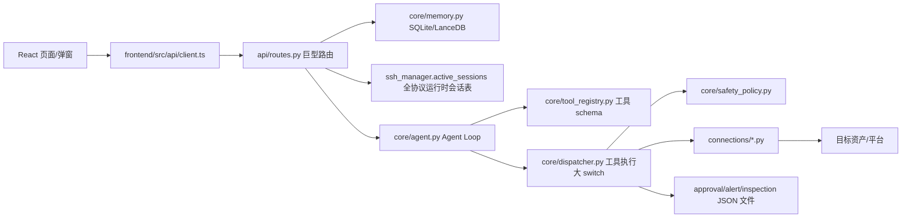
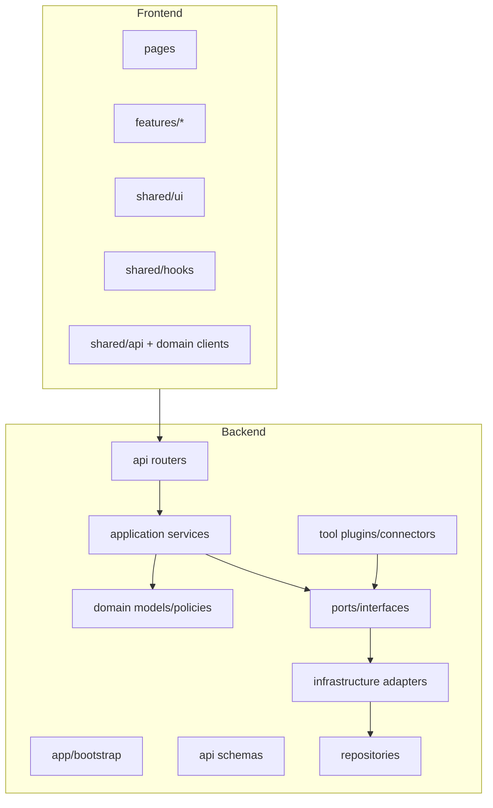
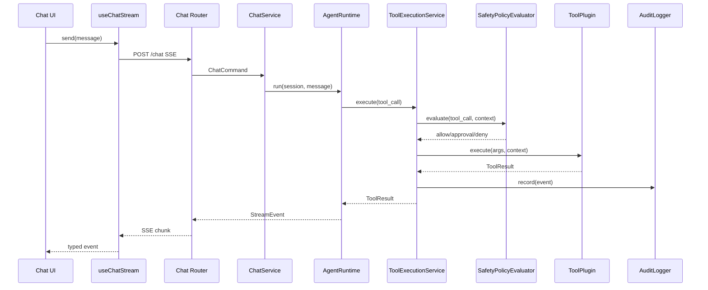

# OpsCore AIOps 产品化重构方案

## 0. 结论摘要

当前项目已经具备 AIOps 控制台的基础业务能力：资产中心、多协议连接、AI 会话、工具调用、安全策略、审批、巡检、告警、知识库、技能市场、模型配置、Webhook 和运维总览。但实现方式是典型的“功能堆叠式开发”：大量业务逻辑集中在少数巨型文件中，模块之间通过全局单例、文件状态、环境变量和隐式字典传递数据，缺少稳定的领域模型、服务边界、错误契约、请求追踪和插件接口。

产品化重构的目标不是重写业务功能，而是在保持现有行为 100% 一致的前提下，把系统重构为可测试、可扩展、可审计、可部署的生产级架构。

## 0.1 当前已落地的重构边界（2026-05-03）

本轮重构已经按“先拆巨型模块、保留兼容 API、每步全量门禁”的原则落地到以下边界。后续重构必须延续这些边界，禁止把新逻辑重新塞回巨型文件。

### 0.1.1 `core/memory.py` 已降级为协调器

`MemoryDB` 当前保留的职责：

- SQLite 连接、schema 初始化和兼容迁移。
- Fernet 加密/解密辅助。
- LanceDB 长期记忆、RAG 相关初始化和检索协调。
- 对旧调用方保持兼容的委托入口。

已经提取出的领域存储：

| 领域 | 新模块 | 职责 |
| --- | --- | --- |
| 会话消息 | `core/session_message_store.py` | 会话消息 CRUD、历史窗口、tool call 顺序修复、附件字段兼容 |
| 资产目录 | `core/asset_store.py` | 资产 CRUD、标签、协议归一化、凭据加密回调、UPSERT |
| 快捷命令 | `core/slash_command_store.py` | 内置/自定义快捷命令持久化和协议过滤 |
| 资产画像 | `core/asset_profile_store.py` | 资产画像读写与兼容更新 |
| Webhook 发送记录 | `core/webhook_delivery_store.py` | 会话 Webhook delivery 状态和查询 |

维护规则：

- 新增 SQLite 业务表时，优先创建对应领域 store，不允许继续扩张 `MemoryDB`。
- `MemoryDB` 只做依赖组装、事务入口和旧接口委托。
- 与会话、资产、配置、命令相关的测试应优先覆盖 store，而不是绕 API 层测试。

### 0.1.2 `connections/db_manager.py` 已拆出执行边界

`DatabaseExecutor` 当前保留的职责：

- 驱动元数据、能力声明和高层路由。
- 对历史静态方法保持兼容的薄包装。
- 不同数据库执行器的统一入口。

已经提取出的执行模块：

| 领域 | 新模块 | 职责 |
| --- | --- | --- |
| SQL 结果格式化 | `connections/db_execution_result.py` | 语句类型判断、commit 语义、查询/非查询结果结构 |
| Oracle 客户端发现 | `connections/oracle_client_discovery.py` | thick-mode client 目录发现、环境变量开关解析 |
| 原生 SQL 执行 | `connections/native_sql_executor.py` | MySQL、PostgreSQL、MSSQL 的连接、执行和关闭 |
| JDBC 执行 | `connections/jdbc_executor.py` | JDBC URL 构建、driver jar/class 校验、JayDeBeApi 执行 |

维护规则：

- 新增数据库方言、驱动参数或执行语义时，应落到 `connections/*executor.py` 或专门方言模块。
- `DatabaseExecutor` 中只保留兼容包装和统一调度，不再新增大段驱动实现。
- 连接执行结果必须通过 `db_execution_result` 统一格式化，保证前端和工具调用结果契约稳定。

### 0.1.3 已完成的产品化切片

| 切片 | 状态 | 验证方式 |
| --- | --- | --- |
| Dispatcher 技能进化、会话工具、通用工具拆分 | 已完成 | 目标测试 + 全量 preflight |
| Session Inspector 模板运行和 profile 边界拆分 | 已完成 | 目标测试 + 全量 preflight |
| `core/memory.py` 的命令、画像、Webhook、消息、资产存储拆分 | 已完成 | 新增 store 单测 + 相关历史/资产测试 + 全量 preflight |
| `connections/db_manager.py` 的结果、Oracle、原生 SQL、JDBC 执行拆分 | 已完成 | 新增执行器单测 + DB manager 兼容测试 + 全量 preflight |

最新完整门禁要求仍以仓库规则为准：提交前必须运行 `python scripts/worktree_audit.py --check-staged` 和 `python scripts/preflight.py --check-git`。本轮已按切片多次通过完整 preflight，最近一次覆盖 894 个后端 unittest、Python 编译、安全扫描、`pip check`、`npm audit` 和前端构建。

## 1. 分析范围与明确假设

### 1.1 已分析范围

- 后端入口：`main.py`
- API 层：`api/routes.py`
- Agent 与工具执行：`core/agent.py`、`core/dispatcher.py`、`core/tool_registry.py`
- 安全策略：`core/safety_policy.py`、`core/safety_action_catalog.py`
- 资产目录：`core/asset_protocols.py`、`core/asset_capabilities.py`、`core/hertzbeat_asset_catalog.py`
- 数据持久化：`core/memory.py`、JSON 存储文件、LanceDB
- 连接管理：`connections/*.py`
- 巡检/告警/审批/画像：`core/inspection_*`、`core/alert_events.py`、`core/approval_queue.py`、`core/session_profile.py`
- 前端入口、状态、API 客户端和核心页面：`frontend/src/App.tsx`、`store/index.ts`、`api/client.ts`、`components/views/*`、`components/modals/*`、`components/chat/ChatWindow.tsx`
- 测试与发布门禁：`tests/*`、`scripts/preflight.py`

### 1.2 明确假设

- “资产”指 OpsCore 托管的运维目标，包括主机、数据库、中间件、网络、虚拟化、存储、监控、带外和业务平台。
- “协议”指连接和执行通道，如 SSH、WinRM、SQL、HTTP API、SNMP、K8s、S3、Redfish。
- “工具”指模型可调用的后端能力，例如 `linux_execute_command`、`db_execute_query`、`storage_api_request`。
- “会话”是资产上下文、模型上下文、工具上下文和安全上下文的运行实例。
- “产品化”指企业私有化交付能力：稳定架构、统一错误、日志追踪、安全审计、测试覆盖、配置外部化、可维护 UI。
- 本方案不新增业务功能，只重构现有功能边界和实现形态。

## 2. 当前技术栈与系统形态

### 2.1 后端技术栈

| 类别 | 当前实现 |
| --- | --- |
| Web 框架 | FastAPI |
| API 模型 | Pydantic v2 |
| 服务运行 | Uvicorn |
| 连接协议 | Paramiko、pywinrm、PyMySQL、psycopg2、oracledb、pyodbc、redis、pymongo、pysnmp、netmiko、pyvmomi、boto3、JayDeBeApi |
| 模型供应商 | OpenAI SDK、Anthropic SDK、OpenAI 兼容供应商 |
| 调度 | APScheduler |
| 存储 | SQLite、JSON 文件、LanceDB |
| 加密 | Fernet |
| 测试 | unittest、pytest |
| 发布门禁 | `scripts/preflight.py`、`scripts/worktree_audit.py` |

### 2.2 前端技术栈

| 类别 | 当前实现 |
| --- | --- |
| 框架 | React 19 |
| 构建 | Vite |
| 语言 | TypeScript，`strict: true` |
| 状态 | Zustand + 大量组件本地 state |
| 样式 | Tailwind CSS |
| Markdown | marked + DOMPurify |
| 路由 | 无真正路由，使用 `currentView` 状态切换 |

### 2.3 当前数据流



### 2.4 当前核心业务模块

| 业务模块 | 主要文件 | 当前实现特点 |
| --- | --- | --- |
| 资产中心 | `api/routes.py`、`core/memory.py`、`core/asset_protocols.py`、`frontend/views/AssetVault.tsx` | 后端目录 + SQLite 资产表 + 前端复杂筛选 |
| 连接管理 | `connections/*.py`、`ssh_manager.active_sessions`、`dispatcher` 上下文解析 | `active_sessions` 实际承担全协议运行时会话表；SSH 有真实 Paramiko client，数据库、HTTP/API、S3、虚拟化、SNMP、WinRM 等通过 session info、extra_args 和各自 manager 按需执行 |
| AI 会话 | `core/agent.py`、`frontend/components/chat/ChatWindow.tsx` | Agent loop、SSE、工具轨迹、审批、附件、画像混在一起 |
| 工具系统 | `core/tool_registry.py`、`core/dispatcher.py` | Registry 只管 schema，执行仍在 dispatcher 大 switch |
| 安全策略 | `core/safety_policy.py`、`core/safety_action_catalog.py`、`SafetyPolicyModal.tsx` | 动作规则与旧规则并存，文件较大 |
| 审批 | `core/approval_queue.py`、`ApprovalCenter.tsx` | JSON 文件持久化，聊天/中心复用 |
| 巡检 | `core/session_inspector.py`、`core/inspection_templates.py`、`core/cron_manager.py`、`CronManager.tsx` | 模板、任务、报告分散 |
| 告警 | `core/alert_events.py`、`AlertCenter.tsx` | JSON 文件存储，Webhook 接入 |
| 知识库 | `core/rag.py`、`api/routes.py`、`KnowledgeBase.tsx` | 文件上传 + LanceDB |
| 技能市场 | `core/dispatcher.py`、`core/skill_lifecycle.py`、`SkillMarket.tsx` | 技能扫描、创建、迁移、回滚与工具执行耦合 |
| 模型配置 | `core/llm_factory.py`、`LLMConfigModal.tsx` | `providers.json` + 环境变量混合 |

## 3. 当前核心架构问题

### 3.1 后端路由层过重

`api/routes.py` 超过 3000 行，包含：

- API DTO。
- 文件解析。
- 连接测试。
- 资产 CRUD。
- 技能管理。
- 模型配置。
- 通知配置。
- 会话历史。
- Webhook。
- 巡检任务。
- 安全策略。
- Dashboard 聚合。

问题：

- Controller 层直接调用数据库、文件系统、连接器、Agent、策略和通知。
- 业务错误在各函数内临时拼装。
- 难以按业务域测试。
- 任意小变更都可能影响大量路由。

### 3.2 Agent、Dispatcher、Tool Registry 边界不完整

`tool_registry.py` 已经具备工具元数据，但执行仍在 `dispatcher.route_and_execute()` 的大分支中。

问题：

- 新增工具需要同时改 registry、dispatcher、安全策略、前端展示。
- 工具执行、策略判断、协议适配、错误转换混在一起。
- 难以按工具独立测试。
- 不利于未来插件化。

### 3.3 数据访问层缺失

`core/memory.py` 同时承担：

- SQLite 初始化和迁移。
- 资产仓储。
- 会话消息仓储。
- 凭据加密。
- 资产画像。
- Webhook 发送记录。
- LanceDB 初始化和长期记忆。

问题：

- 一个类拥有多个业务领域。
- 数据库 schema 与业务逻辑耦合。
- SQLite、LanceDB、文件存储无统一 Repository 抽象。
- 事务边界不清晰。

### 3.4 全局单例和隐式状态过多

典型单例：

- `memory_db`
- `ssh_manager`
- `dispatcher`
- `tool_registry`
- `approval_queue`
- `CronManager`
- `providers.json`
- `safety_policy.json`

问题：

- 测试需要 monkeypatch 全局对象。
- 运行时依赖难以替换。
- 多实例部署和并发安全风险高。
- 请求级上下文无法自然注入。

### 3.5 配置散落

配置来源包括：

- `.env`
- `providers.json`
- `models.json`
- `safety_policy.json`
- `approval_requests.json`
- `inspection_runs.json`
- `cron_jobs.sqlite`
- `opscore.db`
- 源码常量和硬编码路径。

问题：

- 环境变量在业务函数中直接读取。
- 运行时修改环境变量，如 Agent step 上限。
- 驱动路径、通知配置、模型配置和安全策略缺少统一配置服务。

### 3.6 错误处理不统一

当前已有部分 `ResponseModel(status="error")` 和部分 `HTTPException`，前端也在适配二者。

问题：

- HTTP 状态和业务状态混用。
- 错误码体系不完整。
- 用户提示、日志详情、审计详情没有分层。
- API client 需要猜测错误形态。

### 3.7 日志缺少全链路追踪

当前使用 `logging`，但缺少：

- request_id / trace_id。
- session_id / asset_id / tool_call_id 标准字段。
- 结构化日志。
- 外部调用耗时。
- 工具调用审计事件统一落库。

### 3.8 前端组件边界不清

`ChatWindow.tsx` 超过 3300 行，承担：

- 会话输入。
- SSE 流式解析。
- 消息渲染。
- Markdown 渲染。
- 附件上传。
- 审批弹窗。
- 交互卡片。
- 工具轨迹。
- 快捷命令管理。
- 会话画像。
- 安全策略快捷动作。

问题：

- 状态变量过多。
- 组件内业务流程不可复用。
- SSE 解析、视图状态和 UI 混合。
- 单元测试几乎不可做。

### 3.9 前端无业务 service/query 层

`api/client.ts` 超过 800 行，所有 API 函数平铺。

问题：

- 无领域分组。
- 无统一 query/cache/loading/error 抽象。
- 页面自己处理并发、loading、错误和刷新。
- 无 URL 路由导致刷新、深链和过滤条件不可恢复。

### 3.10 存储形态混杂

SQLite、JSON 文件、LanceDB 同时存在。

问题：

- 审批、告警、巡检运行记录使用 JSON 文件，生产并发和审计能力不足。
- SQLite schema 迁移散落在 `init_db()`。
- 没有明确的 Unit of Work。

## 4. 目标架构设计

### 4.1 总体架构



### 4.2 依赖规则

1. API Router 只负责 HTTP 入参、认证、响应，不写业务逻辑。
2. Application Service 编排业务流程，不直接拼 SQL、不直接读写 JSON 文件。
3. Domain 层只表达业务概念和规则，不依赖 FastAPI、SQLite、React。
4. Repository 只负责数据持久化。
5. Connector 只负责外部系统连接和协议执行。
6. Tool Plugin 自带 schema、动作分类、执行器、测试。
7. 前端页面只组合 feature 组件，不直接写复杂业务流程。
8. 前端 API client 按领域拆分，页面通过 hook 使用。

### 4.3 推荐后端目录结构

```text
backend/
  app/
    main.py
    lifespan.py
    container.py
    settings.py
    logging.py
    errors.py
    middleware/
      request_context.py
      auth.py
      security_headers.py
  api/
    v1/
      routers/
        assets.py
        sessions.py
        chat.py
        tools.py
        commands.py
        approvals.py
        safety.py
        inspections.py
        alerts.py
        knowledge.py
        skills.py
        models.py
        notifications.py
        dashboard.py
      schemas/
        assets.py
        sessions.py
        chat.py
        common.py
        errors.py
  domain/
    assets/
      models.py
      catalog.py
      policies.py
    sessions/
      models.py
      events.py
    tools/
      models.py
      registry.py
      policy.py
    safety/
      models.py
      evaluator.py
      action_catalog.py
    inspections/
      models.py
      templates.py
    approvals/
      models.py
    knowledge/
      models.py
    skills/
      models.py
  application/
    assets_service.py
    session_service.py
    chat_service.py
    tool_execution_service.py
    approval_service.py
    safety_policy_service.py
    inspection_service.py
    alert_service.py
    knowledge_service.py
    skill_service.py
    dashboard_service.py
    model_provider_service.py
  ports/
    repositories.py
    connectors.py
    llm.py
    tool_plugins.py
    notifier.py
    vector_store.py
    audit.py
  infrastructure/
    persistence/
      sqlite/
        connection.py
        migrations/
        asset_repository.py
        session_repository.py
        approval_repository.py
        inspection_repository.py
        alert_repository.py
        config_repository.py
      file_store/
        skill_store.py
        knowledge_file_store.py
      lancedb/
        vector_store.py
    connectors/
      ssh.py
      winrm.py
      database.py
      snmp.py
      http_api.py
      object_storage.py
      virtualization.py
      service_probe.py
    llm/
      providers.py
      execution.py
    notifications/
      webhook.py
      dingtalk.py
      wechat.py
      email.py
    tools/
      linux.py
      windows.py
      database.py
      network.py
      storage.py
      platform.py
      knowledge.py
      skill_runtime.py
  tests/
```

### 4.4 推荐前端目录结构

```text
frontend/src/
  app/
    App.tsx
    routes.tsx
    providers/
      AppProviders.tsx
      QueryProvider.tsx
  shared/
    api/
      httpClient.ts
      errors.ts
      types.ts
    ui/
      Button.tsx
      Modal.tsx
      ConfirmDialog.tsx
      EmptyState.tsx
      StatusBadge.tsx
      DataTable.tsx
    hooks/
      useAsync.ts
      useToast.ts
      useDebouncedValue.ts
    utils/
      format.ts
      assetDisplay.ts
  features/
    assets/
      api.ts
      types.ts
      hooks.ts
      components/
      pages/AssetCenterPage.tsx
    chat/
      api.ts
      types.ts
      hooks/
        useChatStream.ts
        useChatAttachments.ts
        useSessionCommands.ts
      components/
        ChatWindow.tsx
        MessageList.tsx
        ChatComposer.tsx
        ToolTrace.tsx
        CommandManager.tsx
        ApprovalDock.tsx
        AssetProfilePanel.tsx
    safety/
      api.ts
      components/
      pages/SafetyPolicyPage.tsx
    inspections/
    alerts/
    approvals/
    knowledge/
    skills/
    dashboard/
    settings/
```

### 4.5 数据流转方式



## 5. 核心重构准则

### 5.1 单一职责

目标：

- `routes.py` 拆成 12 个 router。
- `ChatWindow.tsx` 拆成组合组件和 hooks。
- `MemoryDB` 拆成多个 Repository。
- `Dispatcher` 拆成 Tool Plugin。

准则：

- 一个模块只能有一个修改原因。
- 一个 Service 对应一个业务能力。
- 一个 Repository 对应一个聚合或数据对象。
- 一个 React 组件只负责展示或一个局部交互。

### 5.2 依赖注入

目标：

- 替换全局单例直接 import。
- FastAPI 通过依赖函数注入 Service。
- Service 构造函数注入 Repository、Connector、Policy、Audit。

骨架：

```python
# app/container.py
from dataclasses import dataclass

@dataclass
class AppContainer:
    asset_service: "AssetService"
    session_service: "SessionService"
    chat_service: "ChatService"
    tool_execution_service: "ToolExecutionService"
    safety_policy_service: "SafetyPolicyService"

def build_container(settings: "Settings") -> AppContainer:
    db = SqliteDatabase(settings.database_url)
    audit = StructuredAuditLogger()
    asset_repo = SqliteAssetRepository(db)
    session_repo = SqliteSessionRepository(db)
    policy_repo = JsonOrSqlitePolicyRepository(db)
    connector_registry = ConnectorRegistry.from_settings(settings)
    tool_registry = ToolPluginRegistry.load_builtin(connector_registry)
    return AppContainer(
        asset_service=AssetService(asset_repo, connector_registry, audit),
        session_service=SessionService(session_repo, asset_repo, audit),
        chat_service=ChatService(...),
        tool_execution_service=ToolExecutionService(tool_registry, policy_repo, audit),
        safety_policy_service=SafetyPolicyService(policy_repo, audit),
    )
```

### 5.3 统一错误处理

目标：

- 所有 API 错误统一返回 `ApiErrorResponse`。
- 前端只处理一种错误结构。
- 日志保留技术详情，用户只看友好消息。

后端骨架：

```python
# app/errors.py
from dataclasses import dataclass
from enum import StrEnum

class ErrorCode(StrEnum):
    VALIDATION_ERROR = "VALIDATION_ERROR"
    NOT_FOUND = "NOT_FOUND"
    AUTH_FAILED = "AUTH_FAILED"
    CONNECTION_FAILED = "CONNECTION_FAILED"
    POLICY_DENIED = "POLICY_DENIED"
    APPROVAL_REQUIRED = "APPROVAL_REQUIRED"
    EXTERNAL_SERVICE_ERROR = "EXTERNAL_SERVICE_ERROR"
    INTERNAL_ERROR = "INTERNAL_ERROR"

@dataclass
class AppError(Exception):
    code: ErrorCode
    message: str
    status_code: int = 400
    details: dict | None = None
    user_hint: str | None = None

def app_error_response(error: AppError, request_id: str) -> dict:
    return {
        "status": "error",
        "error": {
            "code": error.code,
            "message": error.message,
            "hint": error.user_hint,
            "details": error.details or {},
            "request_id": request_id,
        },
    }
```

前端骨架：

```ts
// shared/api/errors.ts
export interface ApiErrorPayload {
  code: string
  message: string
  hint?: string
  details?: Record<string, unknown>
  request_id?: string
}

export class ApiError extends Error {
  constructor(
    public payload: ApiErrorPayload,
    public httpStatus: number,
  ) {
    super(payload.message)
  }
}
```

### 5.4 全链路日志

目标：

- 每个请求生成 `request_id`。
- 会话执行生成 `run_id`。
- 工具调用生成 `tool_call_id`。
- 审批、策略、连接、外部调用都有结构化审计事件。

日志字段：

| 字段 | 说明 |
| --- | --- |
| request_id | HTTP 请求级追踪 |
| run_id | 一次 AI 执行或巡检执行 |
| session_id | 会话 ID |
| asset_id | 资产 ID |
| tool_call_id | 工具调用 ID |
| action_id | 动作策略 ID |
| decision | allow/approval/deny |
| duration_ms | 耗时 |
| outcome | success/error/blocked |

骨架：

```python
class AuditLogger:
    def record(self, event_type: str, payload: dict) -> None: ...

class ToolExecutionService:
    async def execute(self, call: ToolCall, context: ExecutionContext) -> ToolResult:
        start = monotonic()
        decision = self.policy.evaluate(call, context)
        self.audit.record("tool.policy_evaluated", {...})
        if decision.denied:
            raise PolicyDenied(...)
        result = await self.plugins.execute(call, context)
        self.audit.record("tool.completed", {"duration_ms": elapsed(start), ...})
        return result
```

### 5.5 配置外部化

目标：

- 所有路径、驱动、模型、通知、安全运行配置进入 `Settings`。
- 环境变量只在 `settings.py` 读取一次。
- 运行时可修改配置进入 ConfigRepository，不直接改 `os.environ`。

骨架：

```python
# app/settings.py
from pydantic_settings import BaseSettings

class Settings(BaseSettings):
    app_env: str = "production"
    host: str = "0.0.0.0"
    port: int = 8000
    database_url: str = "sqlite:///opscore.db"
    lancedb_path: str = "opscore_lancedb"
    oracle_client_lib_dir: str | None = None
    jdbc_driver_dir: str | None = None
    allowed_origins: list[str] = []
    api_token: str | None = None
    log_level: str = "INFO"
    agent_max_steps: int = 80
    headless_agent_max_steps: int = 60

    model_config = {"env_prefix": "OPSCORE_", "env_file": ".env"}
```

### 5.6 代码风格与类型安全

后端：

- Python 3.11+ 类型注解。
- `ruff` + `mypy` 分阶段引入。
- Pydantic 模型区分 API DTO 与 Domain Model。
- 禁止裸 `except:`。
- 禁止业务层直接返回字符串 JSON。

前端：

- 保持 TypeScript strict。
- 开启 `noUnusedLocals`、`noUnusedParameters`。
- 引入 ESLint。
- API 返回类型按领域拆分。
- 组件 props 明确定义。

### 5.7 测试与健壮性

重构期间不追求一次全覆盖，而是建立防回归保护：

- 每迁移一个模块，先写 characterization tests。
- 核心服务有单元测试。
- API router 有契约测试。
- 前端关键 hook 有单元测试。
- 保留现有 `preflight.py`，逐步加入 lint/typecheck。

### 5.8 扩展性与插件化

扩展对象：

- 资产类型目录。
- 协议连接器。
- 工具插件。
- 安全动作识别器。
- 巡检模板。
- 知识库数据源。
- 模型供应商。
- 通知渠道。

原则：

- 新能力通过注册接口接入。
- 不改核心 switch。
- 插件必须声明 schema、权限、错误、审计字段和测试。

## 6. 核心模块接口定义与代码骨架

### 6.1 资产模块

```python
# domain/assets/models.py
from dataclasses import dataclass, field

@dataclass(frozen=True)
class AssetIdentity:
    asset_type: str
    protocol: str
    host: str
    port: int | None
    category: str

@dataclass
class Asset:
    id: int | None
    remark: str
    identity: AssetIdentity
    username: str
    credential_ref: str | None
    extra_args: dict = field(default_factory=dict)
    tags: list[str] = field(default_factory=list)
    agent_profile: str = "default"
```

```python
# ports/repositories.py
from typing import Protocol

class AssetRepository(Protocol):
    def list(self) -> list[Asset]: ...
    def get(self, asset_id: int) -> Asset | None: ...
    def create(self, asset: Asset) -> Asset: ...
    def update(self, asset_id: int, asset: Asset) -> Asset: ...
    def delete(self, asset_id: int) -> None: ...
```

```python
# application/assets_service.py
class AssetService:
    def __init__(self, repo: AssetRepository, catalog: AssetCatalog, audit: AuditLogger):
        self.repo = repo
        self.catalog = catalog
        self.audit = audit

    def create_asset(self, command: CreateAssetCommand) -> Asset:
        identity = self.catalog.resolve(command.asset_type, command.protocol, command.extra_args)
        asset = Asset(...)
        saved = self.repo.create(asset)
        self.audit.record("asset.created", {"asset_id": saved.id, "asset_type": identity.asset_type})
        return saved
```

### 6.2 会话模块

```python
@dataclass
class SessionContext:
    session_id: str
    asset_id: int | None
    host: str
    port: int | None
    asset_type: str
    protocol: str
    username: str
    allow_modifications: bool
    active_skills: list[str]
    tags: list[str]
    extra_args: dict
```

```python
class SessionService:
    async def open_session(self, command: OpenSessionCommand) -> SessionContext: ...
    async def close_session(self, session_id: str) -> None: ...
    def get_context(self, session_id: str) -> SessionContext: ...
    def list_active(self) -> list[SessionContext]: ...
```

### 6.3 连接器模块

```python
from typing import Protocol, Any

@dataclass(frozen=True)
class CredentialRef:
    provider: str
    key: str

@dataclass
class RuntimeSession:
    id: str
    asset_id: int | None
    protocol: str
    target: dict[str, Any]
    credential_ref: CredentialRef | None
    extra_args: dict[str, Any]
    permissions: SessionPermissions

class SessionRegistry(Protocol):
    def create(self, session: RuntimeSession) -> RuntimeSession: ...
    def get(self, session_id: str) -> RuntimeSession: ...
    def list(self) -> list[RuntimeSession]: ...
    def close(self, session_id: str) -> None: ...

class Connector(Protocol):
    protocol: str

    async def test(self, target: ConnectionTarget) -> ConnectionTestResult: ...
    async def open(self, target: ConnectionTarget) -> ConnectorSession: ...
    async def execute(self, session: ConnectorSession, operation: ConnectorOperation) -> ConnectorResult: ...

class ConnectorRegistry:
    def register(self, connector: Connector) -> None: ...
    def get(self, protocol: str) -> Connector: ...
```

重要修正：

- `ssh_manager.active_sessions` 不应继续被视为 SSH manager 的私有状态，它现在事实上是全协议 `SessionRegistry`。
- SSH/Linux 资产确实有 Paramiko client 和长连接会话。
- 数据库、HTTP/API、对象存储、虚拟化、SNMP、WinRM、K8s 等资产多数不是同一种“SSH 会话”，而是运行时上下文 + 托管凭据 + 协议执行器。
- 重构后 `SessionRegistry` 只保存会话上下文，不负责执行协议。
- `ConnectorRegistry` 按协议选择连接器，`CredentialProvider` 负责取密，`ToolPlugin` 负责把模型工具调用翻译为连接器 operation。

迁移映射：

| 当前文件/能力 | 当前承担的资产范围 | 目标连接器 |
| --- | --- | --- |
| `connections/ssh_manager.py` | Linux/Unix、部分网络 CLI、会话注册表 | `infrastructure/connectors/ssh.py` + `application/sessions/session_registry.py` |
| `connections/winrm_manager.py` | Windows PowerShell/命令执行 | `infrastructure/connectors/winrm.py` |
| `connections/db_manager.py` | Oracle、MySQL、PostgreSQL、SQL Server、达梦等 SQL 数据库 | `infrastructure/connectors/database.py`，内部再按 driver 分 adapter |
| `connections/datastore_manager.py` | Redis、MongoDB、Memcached 等缓存/NoSQL | `infrastructure/connectors/datastore.py` |
| `connections/http_api_manager.py` | HTTP API、REST、Prometheus/监控 API、通用平台 API | `infrastructure/connectors/http_api.py` |
| `connections/service_probe_manager.py` | TCP/HTTP/DNS/服务可达性探测 | `infrastructure/connectors/service_probe.py` |
| `connections/object_storage_manager.py` | S3、MinIO、Ceph RGW、云对象存储兼容接口 | `infrastructure/connectors/object_storage.py` |
| `connections/storage_platform_manager.py` | NAS/SAN/存储阵列/存储平台 API | `infrastructure/connectors/storage_platform.py` |
| `connections/virtualization_manager.py` | VMware、OpenStack、Proxmox、虚拟化/私有云平台 | `infrastructure/connectors/virtualization.py` |
| `connections/snmp_manager.py` | SNMP v2/v3 网络与设备读取 | `infrastructure/connectors/snmp.py` |
| `dispatcher` 中的 `k8s_api_request` 路径 | Kubernetes API 操作 | `infrastructure/connectors/kubernetes.py` |

### 6.4 工具插件模块

```python
@dataclass(frozen=True)
class ToolSpec:
    name: str
    toolset: str
    description: str
    input_schema: dict
    safety_category: str
    protocols: set[str]
    asset_types: set[str]

@dataclass
class ToolCall:
    id: str
    name: str
    args: dict

@dataclass
class ToolResult:
    status: str
    data: dict | list | str | None = None
    message: str = ""
    metadata: dict | None = None

class ToolPlugin(Protocol):
    spec: ToolSpec
    async def execute(self, call: ToolCall, context: ExecutionContext) -> ToolResult: ...
```

```python
class LinuxCommandTool:
    spec = ToolSpec(
        name="linux_execute_command",
        toolset="linux-ssh",
        description="在当前 Linux/Unix SSH 会话执行命令",
        input_schema={"type": "object", "properties": {"command": {"type": "string"}}, "required": ["command"]},
        safety_category="linux",
        protocols={"ssh"},
        asset_types=set(),
    )

    def __init__(self, ssh_connector: SshConnector):
        self.ssh = ssh_connector

    async def execute(self, call: ToolCall, context: ExecutionContext) -> ToolResult:
        command = call.args["command"]
        result = await self.ssh.execute_command(context.session_id, command)
        return ToolResult(status="success", data=result)
```

### 6.5 安全策略模块

```python
class SafetyDecision(str, Enum):
    ALLOW = "allow"
    APPROVAL = "approval"
    DENY = "deny"

@dataclass
class SafetyEvaluation:
    decision: SafetyDecision
    reason: str
    action_id: str | None
    severity: str
    requires_approval: bool = False

class SafetyPolicyEvaluator:
    def evaluate(self, call: ToolCall, context: ExecutionContext) -> SafetyEvaluation:
        actions = self.action_detector.detect(call, context)
        boundary = self.network_boundary.evaluate(call, context)
        return self.rule_engine.decide(actions, boundary, context)
```

拆分建议：

```text
domain/safety/
  models.py
  action_detector.py
  readonly_classifier.py
  network_boundary.py
  rule_engine.py
  legacy_rule_adapter.py
```

### 6.6 Agent/Chat 模块

```python
class ChatService:
    def __init__(
        self,
        session_service: SessionService,
        agent_runtime: AgentRuntime,
        message_repo: MessageRepository,
        audit: AuditLogger,
    ):
        ...

    async def stream_chat(self, command: ChatCommand) -> AsyncIterator[ChatStreamEvent]:
        context = self.session_service.get_context(command.session_id)
        run = await self.run_repo.start(...)
        async for event in self.agent_runtime.run(context, command):
            yield event
        await self.run_repo.finish(run.id)
```

```python
class AgentRuntime:
    async def run(self, context: SessionContext, command: ChatCommand) -> AsyncIterator[ChatStreamEvent]:
        messages = self.prompt_builder.build(context, command)
        tools = self.tool_registry.openai_tools(context)
        async for model_event in self.llm.stream(messages, tools):
            ...
```

### 6.7 巡检模块

```python
class InspectionService:
    async def inspect_session(self, session_id: str) -> InspectionReport: ...
    async def run_job(self, job_id: str) -> InspectionRun: ...
    def list_templates(self) -> list[InspectionTemplate]: ...
    def save_template(self, template: InspectionTemplate) -> InspectionTemplate: ...
```

### 6.8 知识库模块

```python
class KnowledgeSource(Protocol):
    source_type: str
    async def scan(self) -> list[KnowledgeDocument]: ...

class KnowledgeService:
    async def upload(self, file: UploadedFile) -> KnowledgeDocument: ...
    async def index(self, document: KnowledgeDocument) -> None: ...
    async def search(self, query: str, filters: KnowledgeFilters) -> list[KnowledgeHit]: ...
```

未来 Obsidian、Git 文档库、Confluence 作为 `KnowledgeSource` 插件接入，不改变会话检索代码。

### 6.9 前端 Chat 拆分骨架

```tsx
// features/chat/pages/ChatPage.tsx
export function ChatPage() {
  const session = useCurrentSession()
  const stream = useChatStream(session?.id)
  const commands = useSessionCommands(session?.id)

  return (
    <ChatLayout
      header={<ChatHeader session={session} />}
      profile={<AssetProfilePanel sessionId={session?.id} />}
      messages={<MessageList messages={stream.messages} />}
      dock={<PendingActionDock />}
      composer={<ChatComposer commands={commands.data} onSend={stream.send} />}
    />
  )
}
```

```ts
// features/chat/hooks/useChatStream.ts
export function useChatStream(sessionId?: string) {
  const [state, dispatch] = useReducer(chatReducer, initialState)

  const send = useCallback(async (input: ChatInput) => {
    const stream = chatApi.stream(sessionId!, input)
    for await (const event of parseChatEvents(stream)) {
      dispatch(chatEventReceived(event))
    }
  }, [sessionId])

  return { ...state, send }
}
```

## 7. 通用组件/服务提炼

### 7.1 后端通用服务

| 服务 | 职责 |
| --- | --- |
| `SettingsService` | 统一运行配置、动态配置和脱敏输出 |
| `ErrorMapper` | 内部异常到 API 错误 |
| `AuditLogger` | 工具、审批、资产、配置、Webhook 审计 |
| `CredentialService` | 加密、脱敏、保留旧密钥 |
| `FileStore` | 原子写、路径校验、版本备份 |
| `ConnectionErrorClassifier` | 协议连接错误分类 |
| `PaginationService` | 统一分页参数和响应 |
| `PolicyDecisionService` | 安全策略决策和说明 |

### 7.2 前端通用组件

| 组件/Hook | 职责 |
| --- | --- |
| `ConfirmDialog` | 删除、恢复默认、危险操作确认 |
| `AsyncButton` | loading、禁用、错误提示 |
| `ErrorBanner` | API 错误统一展示 |
| `EmptyState` | 空状态 |
| `DataToolbar` | 搜索、筛选、刷新 |
| `StatusBadge` | 状态统一颜色 |
| `SidePanel` | 详情抽屉 |
| `useAsyncAction` | 表单提交和错误处理 |
| `usePolling` | 轮询 |
| `useSseStream` | SSE 解析 |

## 8. 目录结构对照表

| 当前位置 | 当前问题 | 重构后位置 |
| --- | --- | --- |
| `api/routes.py` | 所有 API 混在单文件 | `backend/api/v1/routers/*.py` |
| `core/memory.py` | DB、记忆、资产、画像、Webhook 混合 | `infrastructure/persistence/sqlite/*_repository.py` |
| `core/dispatcher.py` | 工具执行大 switch + 技能扫描 | `infrastructure/tools/*.py` + `application/tool_execution_service.py` |
| `core/tool_registry.py` | 只有元数据，无执行插件 | `domain/tools/registry.py` + `ports/tool_plugins.py` |
| `core/safety_policy.py` | 规则、匹配、存储、解释混合 | `domain/safety/*` + `application/safety_policy_service.py` |
| `core/asset_protocols.py` | 目录、归一化、HertzBeat 合并 | `domain/assets/catalog.py` |
| `connections/*.py` | 连接与会话状态混合 | `infrastructure/connectors/*.py` |
| `core/agent.py` | Agent loop、附件、记忆、SSE 事件混合 | `application/chat_service.py` + `domain/sessions/*` + `infrastructure/llm/*` |
| `frontend/src/api/client.ts` | API 全部平铺 | `features/*/api.ts` + `shared/api/httpClient.ts` |
| `frontend/src/components/chat/ChatWindow.tsx` | 3300 行巨型组件 | `features/chat/components/*` + hooks |
| `frontend/src/App.tsx` | Zustand 伪路由 | `app/routes.tsx` |
| `frontend/src/components/views/*.tsx` | 页面直连 API、状态重复 | `features/*/pages` + hooks |

## 9. 扩展点设计

### 9.1 资产类型扩展

```python
class AssetTypeProvider(Protocol):
    def list_types(self) -> list[AssetTypeDefinition]: ...
```

扩展方式：

- 内置目录。
- HertzBeat 参考目录。
- 企业自定义目录。
- 插件目录。

### 9.2 协议连接器扩展

新增协议只需实现：

- `Connector.test`
- `Connector.open`
- `Connector.execute`
- `Connector.close`
- 连接错误分类。

### 9.3 工具扩展

新增工具只需提供：

- `ToolSpec`
- `execute`
- `SafetyActionDetector`
- 单元测试。

### 9.4 知识库数据源扩展

数据源：

- 本地上传。
- Obsidian Vault。
- Git 文档库。
- Confluence。
- 飞书/语雀/SharePoint。

### 9.5 通知渠道扩展

实现 `Notifier`：

```python
class Notifier(Protocol):
    channel: str
    async def send(self, message: NotificationMessage) -> NotificationResult: ...
```

## 10. 两个关键模块测试示例

### 10.1 安全策略测试

```python
def test_readonly_linux_status_is_allowed(policy_evaluator):
    call = ToolCall(id="t1", name="linux_execute_command", args={"command": "systemctl status sshd"})
    context = ExecutionContext(asset_type="linux", protocol="ssh", allow_modifications=False)

    result = policy_evaluator.evaluate(call, context)

    assert result.decision == SafetyDecision.ALLOW


def test_oracle_alter_system_requires_approval(policy_evaluator):
    call = ToolCall(id="t2", name="db_execute_query", args={"sql": "ALTER SYSTEM SWITCH LOGFILE"})
    context = ExecutionContext(asset_type="oracle", protocol="oracle", allow_modifications=True)

    result = policy_evaluator.evaluate(call, context)

    assert result.decision == SafetyDecision.APPROVAL
    assert result.action_id == "sql.admin.alter_system"
```

### 10.2 工具插件测试

```python
async def test_linux_tool_delegates_to_connector(fake_ssh_connector):
    fake_ssh_connector.execute_command.return_value = {"stdout": "ok", "exit_status": 0}
    tool = LinuxCommandTool(fake_ssh_connector)

    result = await tool.execute(
        ToolCall(id="t1", name="linux_execute_command", args={"command": "uptime"}),
        ExecutionContext(session_id="s1", asset_type="linux", protocol="ssh"),
    )

    assert result.status == "success"
    fake_ssh_connector.execute_command.assert_called_once_with("s1", "uptime")
```

## 11. 分阶段实施路线图

### Phase 0：行为冻结与运行时事实建模

处理模块：

- `api/routes.py`
- `core/dispatcher.py`
- `core/tool_registry.py`
- `connections/*.py`
- `frontend/src/api/client.ts`
- 现有测试集

具体操作：

1. 建立 characterization tests，固定当前 API 响应、工具调用结果、安全策略决策、资产连接参数转换和前端关键交互。
2. 输出现有运行时事实清单：会话字段、工具字段、资产字段、协议 extra_args、错误格式、JSON/SQLite 文件格式。
3. 标记所有兼容入口：旧 `/execute`、旧安全规则、旧 slash command、旧资产协议字段。
4. 为 `ssh_manager.active_sessions` 建立兼容包装层，命名为 `LegacyRuntimeSessionStore`，后续迁移到 `SessionRegistry`。
5. 禁止在 Phase 0 改业务行为，只补测试、文档、类型和兼容适配层。

验收标准：

- 当前主要流程不变：资产添加、连接测试、打开会话、AI 工具调用、审批、巡检、Webhook、知识库、技能市场都能按旧行为运行。
- 有一份机器可读的运行时契约清单，覆盖 session、asset、tool、policy、approval、provider、quick command。
- 后续任何重构都能用 Phase 0 测试判断是否破坏旧行为。

### Phase 1：建立架构基座，不迁移业务行为

处理模块：

- `main.py`
- `api/routes.py` 的公共模型。
- 配置、错误、日志、中间件。

具体操作：

1. 新增 `backend/app/settings.py`，集中读取 env。
2. 新增 `backend/app/errors.py`，定义 `AppError` 和统一异常处理。
3. 新增 request context middleware，注入 `request_id`。
4. 新增 `backend/app/container.py`，先包装现有单例，不改变行为。
5. 新增 `api/v1/schemas/common.py`，统一成功和错误响应。
6. 保持旧 `api/routes.py` 可用，先让新框架挂载旧 router。

验收标准：

- 所有现有 API 路径不变。
- `python scripts/preflight.py --check-git` 仍通过。
- 前端无需改动。
- 日志中能看到 request_id。

### Phase 2：拆分 API Router 和 DTO

处理模块：

- `api/routes.py`
- `frontend/src/api/client.ts` 的路径契约。

具体操作：

1. 按业务域拆分 router：assets、sessions、chat、approvals、safety、inspections、alerts、knowledge、skills、models、notifications、dashboard。
2. 把 Pydantic request/response models 移到 `api/v1/schemas/*`。
3. 每拆一个 router，保持 path 和 response shape 完全一致。
4. 添加 API contract tests，覆盖旧路径。

验收标准：

- `api/routes.py` 不再承载业务域路由，只做兼容导入或删除。
- 前端无需修改 endpoint。
- 现有 tests 全通过。

### Phase 3：拆出 Repository 和配置持久化

处理模块：

- `core/memory.py`
- JSON 状态文件：approval、alert、inspection、policy、providers。

具体操作：

1. 建立 `SqliteDatabase` 和 migration runner。
2. 提取 `AssetRepository`、`MessageRepository`、`ProfileRepository`、`WebhookRepository`。
3. 将 JSON 文件存储包装为 Repository 接口，先不急着迁移到 SQLite。
4. 把 Fernet 加解密移入 `CredentialService`。
5. 业务代码通过 Repository 接口访问数据。

验收标准：

- 数据库文件结构不破坏。
- 资产 CRUD、会话历史、画像、Webhook 历史行为一致。
- 新增 repository 单元测试。

### Phase 4：工具执行插件化

处理模块：

- `core/tool_registry.py`
- `core/dispatcher.py`
- `connections/*.py`
- `core/safety_policy.py`

具体操作：

1. 定义 `ToolPlugin`、`ToolSpec`、`ToolResult`。
2. 先把 `linux_execute_command`、`winrm_execute_command`、`db_execute_query` 三个高频工具迁移为插件。
3. `ToolExecutionService` 统一执行：policy -> approval -> plugin -> audit。
4. Dispatcher 保留为兼容层，内部转发到 `ToolExecutionService`。
5. 每迁移一个工具，添加与旧行为一致的 characterization tests。

验收标准：

- Tool schema 与现有模型调用完全兼容。
- 聊天、巡检、execute legacy 路由行为一致。
- 新增工具不需要修改 dispatcher 大 switch。

### Phase 5：安全策略产品化

处理模块：

- `core/safety_policy.py`
- `core/safety_action_catalog.py`
- `SafetyPolicyModal.tsx`
- 前端工具拦截卡片。

具体操作：

1. 拆分 action detector、readonly classifier、network boundary、rule engine。
2. 明确动作策略优先级，旧审批/禁止规则作为高级兜底。
3. 把高级规则从主配置 UI 弱化或折叠。
4. 拦截卡片生成动作规则，不让用户写正则。
5. 网络边界统一覆盖 HTTP GET、Ping、域名、IP、CIDR。

验收标准：

- Linux 常见只读命令默认允许。
- SQL DDL/DML 在读写模式下按动作策略审批/禁止。
- 历史安全策略文件可平滑加载。
- `tests/test_safety_policy.py` 扩展覆盖关键动作。

### Phase 6：前端产品化拆分

处理模块：

- `ChatWindow.tsx`
- `ConnectionModal.tsx`
- `AssetVault.tsx`
- `CronManager.tsx`
- `api/client.ts`
- `App.tsx`

具体操作：

1. 引入真正路由，保留 Zustand 当前视图兼容。
2. 按 feature 拆分 API client。
3. 抽出 `useChatStream`、`useChatAttachments`、`useSessionCommands`、`useApprovals`。
4. 拆分 Chat UI：Header、MessageList、Composer、ToolTrace、ApprovalDock、CommandManager、ProfilePanel。
5. 拆分 ConnectionModal：资产类型选择、连接凭据、协议参数、会话权限、动作按钮。
6. 抽出通用 ConfirmDialog、ErrorBanner、StatusBadge、DataToolbar。

验收标准：

- UI 行为保持一致。
- `npm run build` 通过。
- ChatWindow 主文件降到 300 行以内。
- 每个 feature 目录有 api/types/hooks/components。

## 12. 二次复查补充：100 分必须补齐的遗漏

这次复查后，原方案中最需要补齐的是“全协议连接运行时”和“生产级治理能力”。如果这些不补齐，即使目录变漂亮，也达不到可交付产品标准。

### 12.1 连接体系遗漏修正

旧描述“SSH 会话与虚拟资产统一塞入 SSH manager”不够准确，必须改成以下三层：

| 层级 | 职责 | 不能做什么 |
| --- | --- | --- |
| `SessionRegistry` | 保存会话上下文、资产引用、协议、权限、托管凭据引用、extra_args、运行状态 | 不直接执行 SSH/SQL/HTTP/SNMP 命令 |
| `ConnectorRegistry` | 按协议选择 SSH、WinRM、Database、HTTP、S3、Virtualization、SNMP、K8s 等连接器 | 不保存聊天消息，不判断模型意图 |
| `ToolPlugin` | 把模型工具调用翻译成连接器 operation，并经过安全策略、审批、审计 | 不直接从全局变量取密码，不绕过策略 |

全协议资产必须显式覆盖：

| 资产/协议域 | 当前实现依据 | 重构要求 |
| --- | --- | --- |
| Linux/Unix/SSH | `ssh_manager.py`、`linux_execute_command` | 保留长连接能力，但从 SSH manager 剥离全局 session 表 |
| Windows/WinRM | `winrm_manager.py`、`winrm_execute_command` | PowerShell 参数转义、事件日志读取、权限错误需要标准化 |
| SQL 数据库 | `db_manager.py`、`db_execute_query` | Oracle/MySQL/PostgreSQL/SQL Server/达梦等统一 DatabaseConnector，非查询 SQL 支持读写策略 |
| NoSQL/缓存 | `datastore_manager.py`、Redis/Mongo/Memcached 工具 | 与 SQL 分开，保留不同命令语义和安全动作分类 |
| HTTP/API 平台 | `http_api_manager.py`、多个 `*_api_request` 工具 | 统一 HTTPConnector，补 SSRF、防越界访问、方法级动作策略 |
| 服务探测 | `service_probe_manager.py` | 和 HTTP API 区分，纳入网络边界策略 |
| 对象存储 | `object_storage_manager.py` | S3/MinIO/Ceph RGW/云对象存储按 bucket/object/action 分类 |
| 存储平台 | `storage_platform_manager.py` | NAS/SAN/阵列 API 与对象存储分开建模 |
| 虚拟化/私有云 | `virtualization_manager.py` | VMware/OpenStack/Proxmox 等按 VM、Host、Datastore、Network action 分类 |
| SNMP | `snmp_manager.py` | 只读采集默认安全，写社区或 set 操作必须独立策略 |
| Kubernetes | `k8s_api_request` 当前在 dispatcher 路径中 | 独立 KubernetesConnector，区分 get/list/log/exec/apply/delete |
| 网络/安全/带外/CI/CD/大数据/AI 平台 | tool registry 已有工具名，部分走 HTTP/API | 不能只按 HTTP 处理，必须有资产域动作目录和默认策略 |

### 12.2 生产级治理遗漏

| 必补能力 | 当前风险 | 产品化要求 |
| --- | --- | --- |
| 用户身份与 RBAC | 主要是 API token，中后台操作人不稳定 | 用户、角色、租户/组织、操作人必须进入审批和审计 |
| 请求追踪 | 缺统一 request_id/trace_id | HTTP、SSE、Agent run、tool call、approval、webhook 全链路关联 |
| 审计事件库 | 审批、策略、工具、资产、配置分散 | 建立 `AuditEventRepository`，所有高风险动作不可抵赖 |
| 会话任务持久化 | 刷新页面可能中断流式任务 | `RunRepository` + 可恢复 SSE + cancel/pause/resume 状态 |
| 数据库迁移 | 初始化和 ALTER 分散 | Alembic 或等价迁移系统，JSON 存储逐步迁入表 |
| 配置中心 | 路由层直接写 `.env` 或 JSON | `SettingsService` + `ConfigRepository`，支持环境变量覆盖和敏感值脱敏 |
| 凭据管理 | 密码和 extra_args 在多处字典流转 | `CredentialProvider`、`CredentialRef`、加密存储、最小暴露 |
| 插件生命周期 | tool schema 和执行分离不彻底 | 插件 manifest、健康检查、能力声明、权限声明、测试夹具 |
| API 契约 | 成功/失败语义历史不一致 | 统一 envelope、错误码、OpenAPI contract test、兼容层 |
| 前端状态治理 | 全局 Zustand 混合会话/页面/弹窗/流状态 | feature store、router、query cache、run state、局部 form state 分离 |
| 可观测性 | 只有日志，不够产品化 | metrics、health/readiness、依赖检查、慢工具统计、失败率统计 |
| 安全边界 | 网络边界、文件上传、Webhook、HTTP GET 曾有绕过风险 | SSRF 防护、CIDR/域名策略、上传扫描、路径归一化、出站网络策略 |
| 发布交付 | 缺统一 lint/test/build/security gate | 后端 lint/type/test，前端 lint/type/test/build，依赖漏洞和敏感文件检查 |

### 12.3 旧方案遗漏修正矩阵

| 原方案不足 | 修正后的必须动作 |
| --- | --- |
| 连接管理只写到 `connections/*.py` 和 SSH manager | 建立 `SessionRegistry`、`ConnectorRegistry`、`CredentialProvider`、按协议 connector 的四件套 |
| 数据库和 API 被归到“连接管理”一句话里 | 数据库、NoSQL、HTTP/API、对象存储、虚拟化、SNMP、K8s 分别有协议语义、动作目录、错误映射 |
| 只强调 Controller-Service-Repository | 增加 Application Command/Query、Domain Policy、Infrastructure Adapter、Compatibility Facade |
| 只说统一错误处理 | 增加错误分类：认证失败、授权失败、网络不可达、驱动缺失、协议不支持、凭据错误、目标拒绝、内部错误 |
| 只说日志追踪 | 增加审计事件模型和全链路 trace id，不把日志当审计 |
| 只说插件化工具 | 增加插件安装、启停、能力声明、权限声明、schema version、健康检查 |
| 只说前端拆组件 | 增加 URL 路由、查询缓存、运行中任务状态、弹窗/确认 dock、附件解析状态 |
| 只说测试 | 增加 characterization test，先冻结旧行为，再逐步替换实现 |

### 12.4 100 分判断标准

达到 100 分不是“目录重排完成”，而是满足以下硬条件：

- 新旧行为有自动化契约测试证明一致。
- 每一种资产协议都有明确 connector、动作目录、安全默认值、错误映射和测试夹具。
- 每一次工具执行都能追踪到用户、会话、资产、策略决策、审批记录、结果和审计事件。
- 前端用户能理解错误原因：密码错误、网络失败、驱动缺失、权限不足、内部错误必须区分显示。
- 敏感配置、凭据、运行态数据不再散落在仓库根目录。
- 新增一种资产或工具时，不需要修改 `api/routes.py`、`dispatcher.py` 和巨型前端组件的核心逻辑。

## 13. 生产级完成定义

达到 100 分生产级标准，必须满足：

- 后端每个业务域有独立 router、service、repository。
- 工具执行插件化，不再依赖 dispatcher 大 switch。
- 所有 API 错误统一结构。
- 全链路日志包含 request_id、session_id、tool_call_id。
- 所有配置通过 Settings/ConfigRepository 管理。
- 安全策略以动作策略为主，普通用户可配置。
- 前端每个页面有清晰 feature 边界。
- 巨型组件拆分完成。
- 核心业务模块有单元测试和契约测试。
- 发布门禁包含测试、类型检查、lint、依赖检查、安全扫描、前端 build。
- Hermes、HertzBeat 等外部源码仅作为 reference，不参与常规重构提交。
- `SessionRegistry` 与 SSH manager 解耦，所有协议 connector 都有清晰边界。
- 数据库、HTTP/API、对象存储、虚拟化、SNMP、K8s、WinRM 等非 SSH 资产不再被隐式当成 SSH 虚拟会话处理。
- 每个工具调用都有结构化安全决策、错误分类和审计记录。

## 14. 禁止事项

- 禁止在重构阶段改变 API 路径或响应字段，除非提供兼容层。
- 禁止新增业务功能。
- 禁止把旧行为“一边重构一边优化”。
- 禁止直接删除旧 JSON/SQLite 状态。
- 禁止把安全策略简化成前端判断。
- 禁止让前端重新硬编码资产类型、协议和工具能力。

## 15. 推荐第一步

第一步不是拆 `ChatWindow.tsx`，而是建立后端架构基座：

1. 先做 Phase 0：冻结行为、输出运行时契约、给 `active_sessions` 加兼容包装。
2. 新建 `backend/app/settings.py`。
3. 新建 `backend/app/errors.py`。
4. 新建 request context middleware。
5. 新建 container，先包装现有单例。
6. 写 3 个测试：错误响应、request_id、settings 加载。

这样做的原因是：一旦错误、日志、配置和 DI 基座稳定，后续拆 router、service、repository、工具插件和前端 feature 都有统一目标，不会变成又一轮“换目录式堆砌”。
